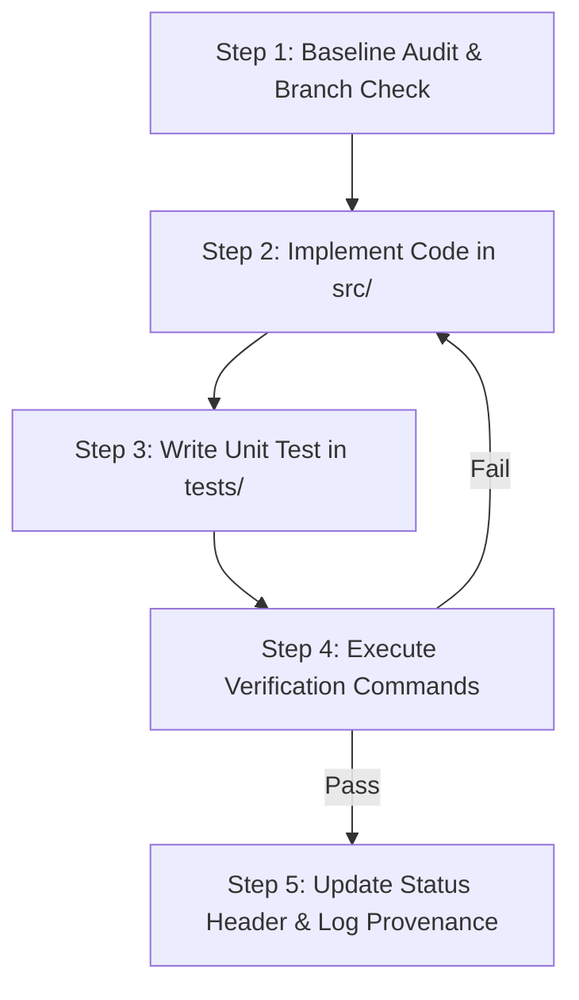

# Master Execution Workflow & Maintenance Guide

**Document Location**: `thesis_docs/recommendations/EXECUTION_WORKFLOW_AND_MAINTENANCE_GUIDE.md`  
**Author**: Leila Gleich  
**Institution**: Embry-Riddle Aeronautical University (ERAU)  
**Target Repository**: `final-thesis` (100% Autonomous Master Project)  
**Version**: v1.0 (Standardized Recommendation Implementation Lifecycle)  
**Date**: September 30, 2026  

---

## 1. Executive Purpose & Overview

This guide establishes the **standardized execution maintenance protocol and uniform workflow** for implementing all technical recommendations (`REC-01` through `REC-14`) across the `final-thesis` codebase.

By establishing a strict recommendation lifecycle, uniform code structure, automated test verification, and provenance logging standards, this protocol guarantees:
1. **Self-Contained Autonomy**: Zero external path dependencies or cross-repository breakage.
2. **Predictable Lifecycle Tracking**: Unambiguous status transitions from `NOT IMPLEMENTED` to `IMPLEMENTED` and `VERIFIED`.
3. **Zero Regression Guarantee**: Every recommendation requires accompanying unit test verification in `tests/`.
4. **Manuscript Synchronization**: Clean traceability between code features in `src/` and thesis manuscript text in `thesis_docs/manuscripts/`.

---

## 2. Recommendation Lifecycle & Status Definitions

Every recommendation document in `thesis_docs/recommendations/implementation_plans/` must maintain an explicit status header on Line 1.

```
┌────────────────────────┐      ┌────────────────────────┐      ┌────────────────────────┐      ┌────────────────────────┐
│ STATUS: NOT IMPLEMENTED│ ───► │   STATUS: IN PROGRESS  │ ───► │   STATUS: IMPLEMENTED  │ ───► │ STATUS: VERIFIED/AUDIT │
└────────────────────────┘      └────────────────────────┘      └────────────────────────┘      └────────────────────────┘
```

| Lifecycle State | Line 1 Header Format | Definition & Requirements |
| :--- | :--- | :--- |
| **1. Backlog (Initial)** | `# STATUS: NOT IMPLEMENTED` | Specification is finalized in `REC-XX_*.md`, but no code has been written in `src/`. |
| **2. Active Development** | `# STATUS: IN PROGRESS` | Development assigned; target modules in `src/` under active modification. |
| **3. Code Complete** | `# STATUS: IMPLEMENTED` | Code written in `src/`, unit tests passing in `tests/`, zero test regressions. |
| **4. Verified & Audited** | `# STATUS: VERIFIED & AUDITED` | Full pipeline `python3 run_pipeline.py` validated, and manuscript/provenance logs updated. |

---

## 3. Uniform 5-Step Execution Workflow

To implement any recommendation (`REC-XX`), the engineer or autonomous subagent must follow this exact 5-step loop:



### Step 1: Baseline Audit & Environment Verification
Before modifying any files:
1. Read the target specification in `thesis_docs/recommendations/implementation_plans/REC-XX_*.md`.
2. Confirm the baseline test suite runs cleanly:
   ```bash
   python3 -m unittest discover -s tests
   ```

### Step 2: Code Implementation in `src/`
1. Locate or create the target module specified in the recommendation file (e.g. `src/features/time_features.py`).
2. Follow standard python coding conventions:
   - Type hints on all function signatures (`def func(df: pd.DataFrame) -> pd.DataFrame:`).
   - Module docstrings explaining mathematical formulations.
   - Vectorized `pandas` / `numpy` operations (avoid explicit row-iterating loops).
   - Use relative repo paths anchored to `BASE_DIR = Path(__file__).resolve().parent.parent`.

### Step 3: Automated Unit Test Creation in `tests/`
Every recommendation must have corresponding unit test assertions in `tests/`:
- Test file naming: `tests/test_REC_XX_<topic>.py` or integrated into existing test files (e.g., `tests/test_cluster_adaptive_pipeline.py`).
- Validate boundary conditions, NaN handling, shape preservation, and mathematical bounds.

### Step 4: Verification & Integration Testing
Execute the test suite and verify acceptance criteria listed in Section 4 of `REC-XX_*.md`:
```bash
# Run specific unit test
python3 -m unittest tests/test_REC_XX_<topic>.py

# Run master pipeline check
python3 run_pipeline.py
```

### Step 5: Status Update & Provenance Logging
Once all verification checks pass:
1. Update Line 1 of `REC-XX_*.md` from `# STATUS: NOT IMPLEMENTED` to `# STATUS: IMPLEMENTED`.
2. Update the master inventory table in `thesis_docs/recommendations/implementation_plans/recs-to-implement.md`.
3. Log the change in `thesis_docs/notes/provenance_and_standards/VERSION_CONTROL_AND_PROVENANCE.md`.

---

## 4. Code & Repository Architecture Rules

```
final-thesis/
├── data/
│   ├── curated/                   <-- Self-contained conformed Parquet/CSV inputs
│   └── sample/                    <-- Lightweight sample data for integration testing
├── src/
│   ├── etl/                       <-- Phase 1: Ingestion, cleaning, audit scripts
│   ├── features/                  <-- Phase 2: Feature convolution, deflation, time terms
│   ├── models/                    <-- Phase 3: Dual-track evaluators, model training
│   └── utils/                     <-- Logger, db connections, path resolvers
├── tests/                         <-- Phase 4: Unit and integration tests
├── results-tables/                <-- Generated evaluation outputs & benchmark CSVs
└── thesis_docs/
    ├── manuscripts/               <-- Chapter 1-5 draft documents (.md and .docx)
    ├── notes/                     <-- Provenance, decision logs, methodology memos
    └── recommendations/           <-- Master implementation plans and chapter guides
        ├── README.md              <-- Master Directory Index
        ├── EXECUTION_WORKFLOW_AND_MAINTENANCE_GUIDE.md  <-- This File
        ├── implementation_plans/  <-- Individual REC-01 to REC-14 Markdown files
        └── chapter_updates/       <-- Chapter 3-5 manuscript update guides
```

### Key Architectural Constraints:
1. **Self-Contained Dependencies**: No imports or relative file paths may reference directories outside `final-thesis/`.
2. **Immutable Raw Data**: Raw source files in `data/raw/` must never be overwritten; all transformations output to `data/curated/` or `results-tables/`.
3. **Deterministic Seed Control**: All stochastic algorithms (LightGBM, K-Means, Train/Val splits) must explicitly set `random_state=42` or `seed=42`.

---

## 5. Quick Reference Verification Matrix

| Target Recommendation | Primary Code File | Unit Test File | Key Verification Command |
| :--- | :--- | :--- | :--- |
| **REC-01** (Minute-of-Day) | `src/features/time_features.py` | `tests/test_time_features.py` | `python3 -m unittest tests/test_time_features.py` |
| **REC-02** (Arrival Kernels) | `src/features/cluster_adapt.py` | `tests/test_cluster_adaptive_pipeline.py` | `python3 -m unittest tests/test_cluster_adaptive_pipeline.py` |
| **REC-03** (Connecting Deflation) | `src/features/demand_deflat.py` | `tests/test_cluster_adaptive_pipeline.py` | `python3 -m unittest tests/test_cluster_adaptive_pipeline.py` |
| **REC-04** (Gauge Tiering) | `src/features/fleet_tiers.py` | `tests/test_fleet_tiers.py` | `python3 -m unittest tests/test_fleet_tiers.py` |
| **REC-05** (Dual-Track Model) | `src/models/dual_track_eval.py` | `tests/test_dual_track.py` | `python3 src/models/dual_track_evaluator.py` |
| **REC-06** (Candidate B Split) | `src/data/split_regimes.py` | `tests/test_splits.py` | `python3 -m unittest tests/test_splits.py` |
| **REC-07** (Airside Flow) | `src/features/airside_flow.py` | `tests/test_airside_flow.py` | `python3 -m unittest tests/test_airside_flow.py` |
| **REC-08** (Curated Data) | `data/curated/` & `run_pipe.py` | `tests/test_architecture.py` | `python3 run_pipeline.py` |
| **REC-09** (Manuscript Sync) | `thesis_docs/manuscripts/` | `N/A` | `grep -E "Candidate B" thesis_docs/manuscripts/*.md` |
| **REC-10** (PCA Synthesis) | `thesis_docs/manuscripts/` | `tests/test_pca.py` | `python3 src/etl/perform_top25_clustering.py` |
| **REC-11** (Multi-Pillar Eval) | `src/models/eval_pillars.py` | `tests/test_eval_pillars.py` | `python3 -m unittest tests/test_eval_pillars.py` |
| **REC-12** (Paradigm Strategy) | `src/models/paradigms.py` | `tests/test_paradigms.py` | `python3 -m unittest tests/test_paradigms.py` |
| **REC-13** (Spatial Engine) | `src/features/checkpoint_map.py` | `tests/test_checkpoint_map.py` | `python3 -m unittest tests/test_checkpoint_map.py` |
| **REC-14** (ETL Audit Suite) | `src/etl/pipeline_audit.py` | `tests/test_pipeline_audit.py` | `python3 src/etl/pipeline_audit.py` |
