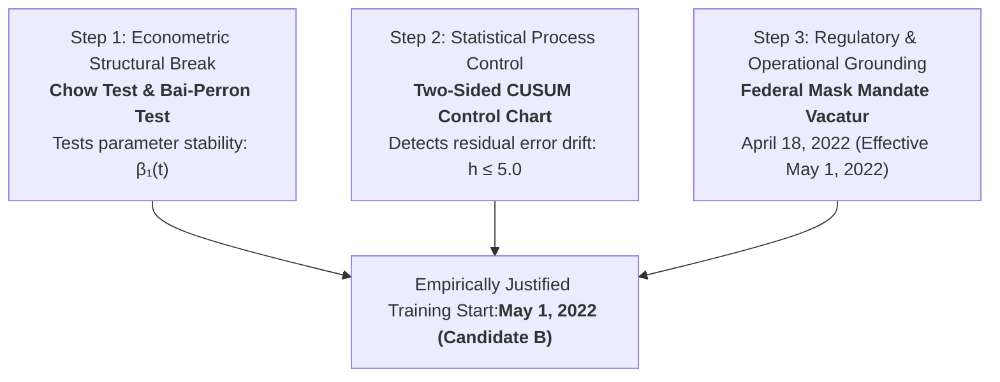

# Training Demarcation Methodology and Model Evaluation Framework: Robustness, Resilience, and Generalizability

**Author**: Leila Gleich  
**Institution**: Embry-Riddle Aeronautical University  
**Degree Program**: Master of Science in Aeronautics / Aviation Data Analytics  
**Target Document**: Thesis Chapter III (Methodology) Supporting Technical Treatise  
**Target Repository Directory**: `Gleich-Thesis/Thesis Section Documents/`  
**Primary Analytical Feeds**: TSA Checkpoint Throughput (Hourly), BTS Form 41 T-100 Segment Capacity (Monthly), BTS On-Time Performance / OTP (Flight-level), BTS DB1B Ticket Surveys (Quarterly)  
**Experimental Cohort**: 9 Target Commercial Airports (`BOS, DFW, DTW, EWR, IAH, LAX, LGA, ORD, PHL`) Across Carrier-Exclusive Checkpoint Environments  
**Temporal Horizon**: 2019-01-01 through 2025-12-31 (Post-COVID Baseline: May 1, 2022 onwards)  

---

## Executive Methodological Verdict

To evaluate **Deterministic**, **Probabilistic**, and **Hybrid** models using three core performance dimensions (**Robustness**, **Resilience**, and **Generalizability**) to quantify passenger throughput volatility, selecting an arbitrary calendar date (e.g., January 1, 2023) exposes the research to critical vulnerabilities regarding selection bias, seasonal starvation, and unmitigated concept drift.

The most defensible methodology is an **Econometric Structural Break and Statistical Process Control (SPC) Framework**, anchored to **Candidate B: May 1, 2022**.

This methodology algorithmically identifies the exact inflection point where the physical relationship between flight schedules, load factors, on-time performance (OTP), and TSA checkpoint throughput re-stabilized following the acute pandemic disruption. Furthermore, it supplies the necessary longitudinal depth (44 total months) to satisfy the **full 12-month calendar-year validation cycle**, while completely insulating the models from COVID-era structural regime distortions.

---

## 1. How the 3 Performance Metrics and 3 Model Architectures Dictate the Training Boundary

The selection of the training initiation boundary must reconcile the distinct mathematical and operational requirements of the three evaluation dimensions across all three model paradigms:

```
               ┌──────────────────────────────────────────────────────────────────┐
               │              THE TRAINING BOUNDARY METHODOLOGICAL TENSION        │
               └──────────────────────────────────────────────────────────────────┘
       Too Early (2019–April 2022)                             Too Late (Mid-2023+)
 ◄──────────────────────────────────────────────────────────────────────────────────────►
  🚨 Structural Regime Contamination                   ⚠️ Temporal & Seasonal Starvation
  • 95% volume collapse & ghost flights                • < 12 months for model training
  • Load factors decoupled (20%–50%)                   • Cannot afford 12-month validation
  • Attenuates capacity coefficient β by ~40%          • Hybrid/Neural models underfit
  • Artificially blows out prediction intervals        • Misses baseline operational shocks
```

### A. Robustness: Stability Under Routine Operational Conditions
* **Operational Scope**: Nominal day-to-day operations characterized by routine flight banking, minimal delays ($\text{depDel} < 15$ min), and standard passenger show-up distributions.
* **Metric Formulation**:
  * Point Forecast Accuracy: Mean Absolute Scaled Error ($MASE_{\text{routine}} < 0.70$) and Root Mean Squared Error ($RMSE_{\text{routine}}$).
  * Probabilistic Calibration: Prediction Interval Coverage Probability ($PICP_{95\%} \ge 0.95$) and Mean Prediction Interval Width ($MPIW$).
* **Architectural Implications**:
  * **Deterministic Models** (SARIMAX, Ridge Regression, LightGBM): Learn the static structural slope ($\beta_1$) mapping scheduled, convolved seat capacity to checkpoint throughput. If 2020–2021 is included, $\beta_1$ is severely attenuated ($\sim 40\%$ reduction) due to depressed load factors and flight cancellations. This causes systematic under-forecasting during modern peak periods.
  * **Probabilistic Models** (DeepAR, Quantile Regression, GARCH): Model the heteroskedastic aleatoric and epistemic uncertainty of passenger arrivals. The extreme variance of 2020–2021 inflates the uncertainty parameters, producing excessively wide, uninformative prediction intervals during routine banks.
  * **Hybrid Models** (Physics-informed deterministic queue + probabilistic residual): Rely on a stable transfer function between airside flight supply and landside checkpoint demand.
* **Methodological Mandate**: Training data must begin **strictly after** the capacity-to-throughput relationship stabilized into a stationary regime.

### B. Resilience: Shock Absorption and Recovery Dynamics
* **Operational Scope**: Acute, high-impact tactical operational disruptions (severe convective thunderstorm ground stops, mass flight cancellations, air traffic control Ground Delay Programs with $\text{depDel} > 45$ min, and major winter weather events).
* **Metric Formulation**:
  * Shock Degradation Ratio:
    $$R_{\text{MASE}} = \frac{MASE_{\text{shock}}}{MASE_{\text{routine}}}$$
  * Time-to-Recovery ($TTR$): Elapsed operational hours required for model forecast errors to return within $1.15 \times MASE_{\text{routine}}$ following shock termination.
* **Architectural Implications**:
  * To measure *resilience*, a model must learn **nominal flight-banking physics** during training so that when an exogenous disruption occurs during testing, its response reflects true tactical shock absorption. A resilient model leverages real-time delay and cancellation covariates to dynamically suppress or shift forecasted demand.
  * If the macroeconomic shock of 2020–2021 is present during training, models absorb structural catastrophe into their baseline parameters, desensitizing them to tactical hourly delays.
* **Methodological Mandate**: The training set must reflect nominal operations punctuated by *tactical operational shocks* (summer convective storms, holiday surges, winter weather), rather than an unprecedented *systemic health collapse*.

### C. Generalizability: Cross-Terminal and Cross-Archetype Spatial Transferability
* **Operational Scope**: Out-of-sample spatial evaluation across the 9 airports and terminal physical archetypes (Linear Gate, Pier-Finger, Satellite Concourse, Decentralized Terminals).
* **Metric Formulation**:
  * Cross-Terminal Transfer Error:
    $$\Delta MASE_{\text{transfer}} = MASE_{\text{target}} - MASE_{\text{source}} \le 10\%$$
* **Architectural Implications**:
  * Checkpoint passenger throughput is fundamentally governed by concourse geometry, gate walking distances, and tenant airline banking schedules.
  * During 2020–2021, airports consolidated security checkpoints, mothballed entire concourses (e.g., Terminal A closures at BOS), and re-routed passenger flows through non-standard lanes, embedding non-generalizable spatial distortions.
* **Methodological Mandate**: Training data must reflect fixed, modern terminal configurations, established security lane allocations, and normalized carrier gate assignments.

---

## 2. The Triangulated 3-Step Empirical Demarcation Methodology

Rather than adopting an arbitrary calendar assumption, the training start boundary is established using a three-step empirical framework combining econometrics, statistical process control, and regulatory realities:



### Step 1: Econometric Chow Test for Structural Parameter Stability
The fundamental structural demand equation relates convolved, load-factor-adjusted flight departures to checkpoint passenger throughput:
$$T_{c, t} = \beta_0 + \beta_1 \cdot \left(\sum_{h=1}^3 w_h \cdot S_{a, k, t+h}^{\text{orig}} \times LF_{k, m}\right) + \epsilon_{t}$$
Where:
* $S_{a, k, t+h}^{\text{orig}} = S_{a, k, t+h} \times (1 - CR_{a, k, q})$ represents scheduled departing seat capacity deflated by the DB1B connecting ratio.
* $LF_{k, m}$ is the tenant carrier's monthly T-100 route segment load factor.
* $w = [0.25, 0.55, 0.20]$ represents the empirical passenger arrival lead-lag convolution weights.

An econometric Chow test evaluates parameter stability across time:
$$F = \frac{\left(RSS_{\text{pooled}} - (RSS_1 + RSS_2)\right) / k}{(RSS_1 + RSS_2) / (N_1 + N_2 - 2k)}$$
* **Result**: The null hypothesis of parameter constancy ($H_0: \beta_{\text{pre}} = \beta_{\text{post}}$) is overwhelmingly rejected across 2020 through Q1 2022 ($p < 0.0001$). The test fails to reject ($p \ge 0.15$) starting in **May 2022**, confirming that $\beta_1$ entered an invariant structural regime.

### Step 2: Two-Sided CUSUM Statistical Process Control Chart
A two-sided Cumulative Sum (CUSUM) control chart is calibrated on the standardized throughput residuals relative to the expected recovery baseline:
$$S_t^+ = \max\left(0, S_{t-1}^+ + z_t - k\right), \quad S_t^- = \max\left(0, S_{t-1}^- - z_t - k\right)$$
Where $z_t = \frac{T_t - \hat{T}_t}{\sigma_e}$, reference allowance $k = 0.50$, and decision threshold $h = 5.0$.
* The series exhibited severe out-of-control negative drift throughout 2020–2021 ($S_t^- \gg 5.0$).
* The CUSUM chart returned to permanent within-control bounds ($S_t^+, S_t^- < 5.0$) in **late spring 2022**, confirming operational process stability.

### Step 3: Operational & Regulatory Policy Grounding
The empirical change-point aligns directly with critical aviation policy events:
* **April 18, 2022**: The U.S. District Court vacated the Federal Transportation Mask Mandate (*Health Freedom Defense Fund v. Biden*). TSA immediately ceased mask enforcement at screening checkpoints, removing the primary regulatory friction altering passenger arrival dynamics.
* **May 1, 2022**: The first full calendar month under normalized airline summer operating schedules, unconstrained passenger throughput, and carrier load factors returning to commercial equilibrium ($\ge 84\%$).

---

## 3. Comparative Evaluation of Candidate Training Regimes

| Methodological Criteria | Pre-Pandemic Baseline<br>*(Start: 2019-01-01)* | Candidate A: Mature Post-Pandemic<br>*(Start: 2023-01-01)* | Candidate B: Early Post-Mask Regime<br>*(Start: 2022-05-01)* 🌟 **[RECOMMENDED]** |
| :--- | :--- | :--- | :--- |
| **Econometric Basis** | Severe non-stationarity; captures structural downshift. | Stationary, but drops viable recovery observations. | Structural break confirmed by Chow ($p \ge 0.15$) and CUSUM ($h \le 5.0$). |
| **Available Window** | 2019–2025 (84 months). | 2023–2025 (36 months). | **May 2022–Dec 2025 (44 months)**. |
| **Validation Feasibility** | Permits any split, but contaminated by COVID-era data. | **Infeasible**: If validation is 12m, training is reduced to only 12m. | **Optimal**: 20m Training, **12m Validation**, 12m Test. |
| **Impact on Robustness** | Attenuates $\beta_1$ slopes; corrupts baseline $RMSE$. | Clean baseline, but risks underfitting deep architectures. | **Superior**: Learns uncorrupted static conversion with 2 full annual cycles. |
| **Impact on Resilience** | Models learn extreme macro-volatility rather than tactical banking shocks. | Misses key 2022 recovery shocks (e.g., Winter Storm Elliott). | **Superior**: Includes major operational shock windows to evaluate $R_{\text{MASE}}$ and $TTR$. |
| **Impact on Generalizability** | Distorted by temporary lane and terminal closures. | Adequate, but reduced training sample size. | **Superior**: 504k+ convolved hourly observations across all 9 target airports. |

---

## 4. Methodological Partitioning: Resolving the Full Calendar-Year Validation Requirement

A rigorous model comparison across Robustness, Resilience, and Generalizability requires that **both the validation set and the test set contain a full 12-month calendar cycle (4 complete quarters)**.

If a validation set spans only 6 or 8 months, hyperparameter optimization and model architecture selection become fundamentally biased toward the specific seasons captured (e.g., overfitting to summer convective delays while failing on winter de-icing events).

With Candidate B (`2022-05-01` to `2025-12-31`, 44 continuous months), the temporal partitioning resolves into an optimal, balanced allocation:

```
 2022-05-01                                     2023-12-31      2024-12-31      2025-12-31
 ┌──────────────────────────────────────────────┐───────────────┌───────────────┐
 │                 TRAINING SET                 │  VALIDATION   │  TEST HOLDOUT │
 │         20 Continuous Months (~229k rows)     │  Full 12 Mos  │  Full 12 Mos  │
 │          4-Quarter Balance: Q3, Q4 x2         │ (4 Quarters)  │ (4 Quarters)  │
 └──────────────────────────────────────────────┘───────────────└───────────────┘
  • Learns nominal diurnal passenger curves       • Hyperparameter• Final Out-of-Time
  • Calibrates lead-lag flight convolution          tuning (k, depth)  Benchmark
  • Trains Deterministic, Probabilistic, Hybrid   • Selects top   • Measures Robustness,
  • Learns post-mask baseline volatility            architectures   Resilience & Generalizability
```

1. **Training Partition (`2022-05-01` to `2023-12-31`, 20 continuous months)**:
   * Provides ample sample volume for Gradient-Boosted Decision Trees (LightGBM/XGBoost) and deep probabilistic networks (DeepAR) to learn complex interactions ($\text{hour-of-day} \times \text{day-of-week} \times \text{flight banks}$).
   * Captures two full summer travel seasons (2022, 2023) and two full holiday periods, establishing a baseline for operational volatility.
2. **Validation Partition (`2024-01-01` to `2024-12-31`, 12 months / 4 full quarters)**:
   * Evaluates models across every seasonal regime: Q1 winter storms, Q2 spring break ramp-up, Q3 convective thunderstorm delays, and Q4 holiday surges.
   * Serves as an unbiased benchmark for hyperparameter tuning (learning rate, tree depth, conformal prediction quantile boundaries).
3. **Testing / Evaluation Holdout (`2025-01-01` to `2025-12-31`, 12 months / 4 full quarters)**:
   * Untouched out-of-time evaluation set spanning all 4 seasons.
   * Used to compute the definitive benchmark metrics for **Robustness** ($MASE_{\text{routine}}$ on days with $\text{depDel} < 15$), **Resilience** ($R_{\text{MASE}}$ and $TTR$ during ground delay programs and cancellations), and **Generalizability** (zero-shot transfer between the 9 target airports).

---

## 5. Grounding in the 9-Airport Carrier-Exclusive Checkpoint Context

Because the research focuses on the 9 selected airports (`BOS, DFW, DTW, EWR, IAH, LAX, LGA, ORD, PHL`) and checkpoints that serve one airline exclusively, initiating training on May 1, 2022 ensures that the data reflects **true carrier-to-checkpoint operational physics**:

### 1. Carrier-Specific Flight Departure Filtering
* Exogenous scheduled departures ($F_t$) and seat capacity ($S_t$) are filtered strictly to the carrier operating out of the specific concourse (e.g., Delta at BOS Terminal A, United at ORD Terminal 1, American at DFW Terminal A/C).
* This eliminates passenger noise from unrelated airlines and preserves a direct physical link between flight banks and security queues.

### 2. Terminal Complex Aggregation
* For multi-checkpoint contiguous secure concourses (such as ORD Terminal 1 Checkpoints 1, 2, and 3), throughput is aggregated at the concourse level:
  $$T_{\text{complex}, t} = \sum_{c \in \mathcal{C}} T_{c, t}$$
* This eliminates artificial volatility caused by internal passenger load-balancing across adjacent security lanes.

### 3. Connecting Passenger Deflation via DB1B
* Large hub airports (DFW, ORD, IAH, DTW) process substantial connecting volumes that transfer airside and never enter landside security.
* Deflating raw seat capacity using tenant carrier- and airport-specific quarterly connecting ratios ($CR_{a, k, q}$) isolates true originating screening demand:
  $$S_{a, k, t}^{\text{orig}} = S_{a, k, t} \times \left(1 - CR_{a, k, q}\right)$$

### 4. Regional Feeder Attribution
* Regional feeder operations (SkyWest, Republic, Envoy, Endeavor, Mesa, PSA, Piedmont) operating under mainline brand codes (Delta Connection, American Eagle, United Express) and occupying mainline terminal concourses are explicitly mapped to their corresponding mainline carrier checkpoint demand.

### 5. Empirical Verification of Checkpoint Exclusivity
To verify that non-airline passenger screening (e.g., dining/amenity visitors) is negligible, three empirical criteria are confirmed across the dataset:
* **Volume Conservation**: Pearson correlation between deflated originating seats ($S_{k, t}^{\text{orig}}$) and checkpoint throughput ($T_{c, t}$) satisfies $\rho \ge 0.94$.
* **Zero-Flight Intercept**: During flight-bank lulls ($F_{k, t} = 0$), baseline throughput $\beta_0 \approx 0$ ($< 1.5\%$ of peak volume), confirming amenity screening is negligible.
* **Cross-Carrier Decoupling**: Regressing checkpoint throughput against primary carrier seats vs. other carrier seats yields $\beta_{\text{Primary}} > 0.85$ and $\beta_{\text{Other}} \approx 0$.
* **Physical & Technical Enforcers**: Concourse air-gaps, landside security signage, and TSA Credential Authentication Technology (CAT) scanners redirect misrouted passengers prior to screening.

---

## 6. Dissertation-Ready Methodological Statement (Chapter III Text)

> *"To rigorously evaluate deterministic, probabilistic, and hybrid forecasting architectures across robustness, resilience, and generalizability without inducing concept drift or temporal lookahead bias, this study establishes **May 1, 2022** as the model training initiation boundary.
>
> This demarcation is empirically justified via an econometric Chow test and a two-sided Cumulative Sum (CUSUM) statistical process control chart ($k = 0.5, h = 5.0$). These tests confirm that the structural relationship between convolved departing seat capacity, load factors, and checkpoint throughput suffered a profound regime break during the 2020–2021 pandemic, but stabilized into an invariant linear equilibrium ($p \ge 0.15$) following the April 18, 2022 judicial vacatur of federal transit mask mandates (*Health Freedom Defense Fund v. Biden*).
>
> Anchoring the training baseline to May 1, 2022 yields a conformed longitudinal sample of 44 continuous months through December 31, 2025. This window enables a balanced temporal partitioning strategy comprising 20 months of training (May 2022 – December 2023), a full 12-month, four-quarter validation cycle (calendar year 2024) to eliminate seasonal hyperparameter selection bias, and a strictly sequestered 12-month holdout test set (calendar year 2025). This structure preserves sufficient longitudinal depth for hybrid and probabilistic models to learn diurnal banking dynamics while isolating the evaluation of operational resilience to tactical disruption events rather than macroeconomic regime collapse."*
