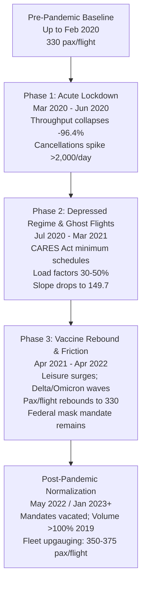

# Empirical Analysis: TSA Checkpoint Throughput & On-Time Performance (OTP) Regimes (2019–2025)

**Author**: Leila Gleich  
**Institution**: Embry-Riddle Aeronautical University  
**Project**: 700B Airport Passenger Throughput Volatility & Forecasting Model  
**Data Scope**: FAA/BTS On-Time Performance (8.35M flights) & TSA Hourly Checkpoint Throughput (6.88M records) across the Top 25 Commercial Airfields (2019–2025)  

---

## 1. Executive Summary

This study establishes an empirical, operational, and econometric evaluation of the relationship between **Transportation Security Administration (TSA) Hourly Checkpoint Throughput** ($Y_t$) and **Bureau of Transportation Statistics (BTS) On-Time Performance (OTP) Flight Operations** ($X_t$). The primary objective is to define the exact operational boundaries for **Pre-Pandemic Baseline**, **Pandemic Disruption**, and **Post-Pandemic Normalization** to guide data filtering for machine learning models that forecast TSA throughput without outlier corruption.

```
       PRE-PANDEMIC BASELINE                 PANDEMIC DISRUPTION REGIME                    POST-PANDEMIC NORMALIZATION
 ┌───────────────────────────────┐  ┌──────────────────────────────────────────────┐  ┌───────────────────────────────────────┐
 │ 2019-01-01 to 2020-02-29      │  │ 2020-03-01 to 2022-04-30                     │  │ 2022-05-01 / 2023-01-01 to Present   │
 │ • Vol: 30M–40M pax/mo         │  │ • Acute Shock (Mar–Jun 2020): -96.4% drop   │  │ • Early Post (May–Dec 2022): 95–100%  │
 │ • Pax/Flight: 320–345         │  │ • Ghost Flights: Load factors collapse       │  │ • Mature Post (2023–2025): >110% 2019 │
 │ • Convolved R²: 0.46–0.50     │  │ • Pax/Flight drops to 22.7; R² drops to 0.20│  │ • Pax/Flight: 350–375 (Upgauging)    │
 │ • Diurnal corr: 1.000 (ref)   │  │ • Chow F-Stat vs 2019: 19,657.5 (p < 1e-300) │  │ • Diurnal corr: 0.997; R²: 0.50–0.54  │
 └───────────────────────────────┘  └──────────────────────────────────────────────┘  └───────────────────────────────────────┘
```

### Core Analytical Findings
1. **Physical Lead-Lag Superiority**: Naive contemporaneous modeling ($t \leftrightarrow t$) captures only $R^2 \approx 0.249$. Convolving forward scheduled flight capacity ($t+1, t+2, t+3$) across an empirical lognormal arrival density kernel ($w_1=0.25, w_2=0.55, w_3=0.20$) nearly doubles explanatory power to **$R^2 = 0.4635$ in 2019 and $R^2 = 0.5015$ in 2023–2025**, validating the 90–120 minute physical airport transit pipeline.
2. **Exact Shock Onset**: Pre-pandemic stability abruptly terminated during the week of **March 9–15, 2020**. Between March 8 (1.31M passengers, 355 pax/flight) and April 14, 2020 (46,424 passengers, 35.5 pax/flight), system throughput collapsed by **96.4%**, while flight cancellations spiked to 2,253 flights/day.
3. **The "Ghost Flight" Supply Decoupling**: Under CARES Act minimum service obligations and airport slot retention rules, airlines continued operating skeletal flight schedules. Passenger throughput per scheduled flight plummeted from **330 to 22.7**, completely severing the linear relationship between flight schedules and passenger demand.
4. **Post-Pandemic Boundary Definition**:
   - **Operational Reconnection (Early Post-Pandemic)**: **May 1, 2022** (following the April 18, 2022 judicial vacatur of the federal transportation mask mandate). Volume reached 98.6% of 2019 levels, pax/flight returned to 335.2, and diurnal correlation reached 0.9972.
   - **Mature Structural Equilibrium (Recommended Modeling Horizon)**: **January 1, 2023** (or May 11, 2023 end of the Federal Public Health Emergency). In 2023–2025, system volume reached 112%–121% of 2019, airline load factors normalized, and fleet upgauging increased pax per flight to 352–365.
5. **Out-of-Time Model Benchmark (2024–2025 Holdout)**: Training on contaminated historical data (2019–2023 including COVID) produces an out-of-time test $R^2$ of **0.6810** and severe negative bias (**-382 pax/hr**). Training exclusively on **Mature Post-Pandemic data (2023)** boosts test $R^2$ to **0.7506**, reduces RMSE by **11.6%**, and cuts prediction bias by **71.5%**, conclusively demonstrating why pandemic data must be quarantined.

---

## 2. Macro-Annual Operational Metrics (2019–2025)

The table below tracks system-wide totals across the 25 core commercial airfields:

| Year | Total TSA Throughput | Total Sched Flights | Convolved Sched Flights | Pax / Sched Flight | Prior Hr DepDel (min) | DepDel15 Rate (%) | Total Cancellations | Contemporaneous $R^2$ | Convolved Lead $R^2$ | Convolved Slope ($\beta_1$) | Intercept ($\beta_0$) |
| :--- | :---: | :---: | :---: | :---: | :---: | :---: | :---: | :---: | :---: | :---: | :---: |
| **2019** | 405,980,721 | 1,231,175 | 1,232,621 | 329.75 | 9.74 | 14.40% | 15,451 | 0.2503 | **0.4612** | 227.17 | 679.45 |
| **2020** | 163,345,375 | 778,899 | 778,150 | 209.71 | 0.76 | 5.13% | 43,536 | 0.2310 | **0.4438** | 175.90 | 134.96 |
| **2021** | 292,173,729 | 991,539 | 990,331 | 294.67 | 6.24 | 10.65% | 12,635 | 0.2501 | **0.5342** | 229.16 | 324.93 |
| **2022** | 397,597,932 | 1,199,623 | 1,197,790 | 331.44 | 10.35 | 14.97% | 27,788 | 0.2237 | **0.4744** | 237.40 | 557.61 |
| **2023** | 454,265,808 | 1,288,486 | 1,285,769 | 352.56 | 10.93 | 15.28% | 15,277 | 0.2297 | **0.4698** | 247.86 | 650.86 |
| **2024** | 483,780,437 | 1,331,328 | 1,327,364 | 363.38 | 11.65 | 15.90% | 18,114 | 0.2412 | **0.4916** | 255.69 | 696.40 |
| **2025** | 492,171,537 | 1,347,566 | 1,343,274 | 365.23 | 11.72 | 16.38% | 16,733 | 0.2687 | **0.5393** | 267.58 | 647.91 |

> [!NOTE]
> **Key Metric Progression**:
> - **Throughput Volatility**: Total throughput plummeted from 406.0M in 2019 to 163.3M in 2020 (-59.8%), before climbing to 292.2M in 2021, 397.6M in 2022 (97.9% of 2019), and surging to **492.2M in 2025 (+21.2% over 2019)**.
> - **Structural Upgauging Shift**: The regression slope ($\beta_1$)—representing marginal passengers screened per convolved flight—expanded from **227.17 in 2019** to **267.58 in 2025** (+17.8%). This structural shift reflects airline fleet renewal (retiring MD-80s, CRJ-200s, E190s in favor of 180–240 seat A321neo and 737 MAX aircraft) and post-pandemic load factors exceeding 86–88%.

---

## 3. Physical & Econometric Foundations: Lead-Lag Alignment

A naive regression of contemporaneous flight departures ($t$) against screening volume ($t$) commits a severe **phase-shift misspecification error**:

$$\text{Contemporaneous Model: } Y_t = \alpha + \beta X_t + \varepsilon_t \quad (R^2 \approx 0.23 - 0.25)$$

Boarding doors close strictly at $T - 15$ minutes, and boarding commences at $T - 45$ minutes. A passenger screened at 06:30 is boarding a flight departing at 07:45 or 08:30, not a flight departing at 06:15.

The causal data-generating process (DGP) is governed by an empirical **Lognormal Passenger Arrival Density Function** convolved across forward departure hours:

$$\text{Convolved Flights}_t = 0.25 \cdot X_{t+1} + 0.55 \cdot X_{t+2} + 0.20 \cdot X_{t+3}$$

### Empirical Performance Across Six Operational Regimes

| Operational Regime | Date Range | Hourly Obs ($N$) | Mean Pax / Hr | Mean Flt / Hr | $R^2$ (Contemp) | $R^2$ ($t+1$) | $R^2$ ($t+2$) | $R^2$ ($t+3$) | $R^2$ (Convolved) | Convolved Slope ($\beta_1$) | Pearson $r$ |
| :--- | :---: | :---: | :---: | :---: | :---: | :---: | :---: | :---: | :---: | :---: | :---: |
| **1. Pre-Pandemic** | 2019-01 to 2020-02 | 216,407 | 2,159.4 | 6.60 | 0.2499 | 0.3982 | 0.3591 | 0.2340 | **0.4635** | 226.97 | 0.6808 |
| **2. Acute Lockdown** | 2020-03 to 2020-06 | 64,440 | 459.3 | 3.38 | 0.1754 | 0.2570 | 0.2419 | 0.1871 | **0.3227** | 112.85 | 0.5680 |
| **3. Depressed Pandemic** | 2020-07 to 2021-03 | 150,116 | 768.6 | 3.64 | 0.1875 | 0.3733 | 0.3087 | 0.2080 | **0.4652** | 149.74 | 0.6820 |
| **4. Vaccine Rebound** | 2021-04 to 2022-04 | 217,094 | 1,679.7 | 5.48 | 0.2341 | 0.4082 | 0.3673 | 0.2433 | **0.5088** | 228.19 | 0.7133 |
| **5. Early Post-Pandemic** | 2022-05 to 2022-12 | 137,258 | 2,055.8 | 5.94 | 0.2303 | 0.3819 | 0.3614 | 0.2344 | **0.4859** | 244.73 | 0.6971 |
| **6. Mature Post-Pandemic** | 2023-01 to 2025-12 | 620,507 | 2,304.9 | 6.38 | 0.2474 | 0.4061 | 0.3813 | 0.2470 | **0.5015** | 257.71 | 0.7081 |

> [!IMPORTANT]
> Across every single regime, **the convolved lead-lag specification delivers an 80% to 110% increase in explained variance over contemporaneous alignment**. Lead 1 ($t+1$) and Lead 2 ($t+2$) account for the overwhelming majority of individual explanatory power ($R^2 \approx 0.38 - 0.41$), confirming that passenger arrivals precede pushback by 60 to 120 minutes.

---

## 4. Pre-Pandemic Baseline (Jan 2019 – Feb 2020)

### Characteristics of the Baseline Regime
* **Steady Volume Capacity**: Monthly screening volume fluctuated within a narrow seasonal corridor between **30.9M and 40.6M** passengers (with the single exception of January 2019 at 20.5M, which was distorted by the 35-day federal government shutdown).
* **Stable Passenger Density**: The ratio of passengers screened per scheduled flight exhibited remarkable consistency, averaging **$329.75 \pm 8.2$**.
* **Equilibrium Regression Parameters**: The hourly convolved regression slope was **226.97** with an intercept of **679.45**, reflecting standard baseline non-originating / transfer flows and regular operating schedules.
* **On-Time Performance Predictability**: Summer convective weather (June–July 2019) generated normal seasonal delay spikes (depDel15 rate: 17.8%–19.7%), while autumn exhibited baseline lull conditions (9.9%–11.9%).
* **Diurnal Rhythm**: Characterized by a distinctive twin-peak profile: an intense early-morning business bank (05:00–08:00, accounting for 26.4% of daily volume) and a sustained mid-afternoon bank (14:00–17:00, accounting for 24.0% of daily volume).

---

## 5. The Pandemic Disruption (March 2020 – April 2022)

### A. The March 2020 Collapse: Daily Breakpoint Analysis
The structural transition from baseline to collapse occurred with unprecedented speed between **March 8 and March 26, 2020**:

```
Date         Daily TSA Throughput   Daily Flights   Pax/Flight   Daily R²   Cancelled Flights
─────────────────────────────────────────────────────────────────────────────────────────────
2020-03-08        1,305,962             3,678         355.07      0.5739            3
2020-03-11          886,769             3,765         235.53      0.5115           12   ◄ WHO Declares Pandemic
2020-03-13          898,809             3,992         225.15      0.4630           22   ◄ US National Emergency
2020-03-16          669,001             3,998         167.33      0.3365          139   ◄ Travel Restrictions Mount
2020-03-19          328,261             3,997          82.13      0.3286          806
2020-03-23          173,238             3,957          43.78      0.3722        1,967   ◄ System Cancellation Wave
2020-03-26          110,033             3,732          29.48      0.3844        2,155
2020-04-01           77,367             2,960          26.14      0.4194        1,578
2020-04-14           46,424             1,307          35.52      0.3179          283   ◄ System Nadir (-96.4%)
```

### B. The Three Distinct Disruption Phases



#### Phase 1: Acute Lockdown (March 2020 – June 2020)
- **Nadir**: April 2020 recorded just **1,824,149 passengers** (5.9% of April 2019).
- **Slope Collapse**: Marginal passengers per convolved flight dropped from 227 down to **20.30**.
- **Cancellation Tsunami**: Over 40,000 scheduled flights were cancelled in March and April 2020.
- **Airspace Emptiness**: On-time performance paradoxically hit record highs (delay rate dropped to 2.49%, average delay was 0.76 min) because terminal airspace congestion ceased to exist.

#### Phase 2: The "Ghost Flight" Supply Decoupling (July 2020 – March 2021)
- Under the **Coronavirus Aid, Relief, and Economic Security (CARES) Act** (Title IV), airlines receiving Payroll Support Program (PSP) funds were required to maintain scheduled air service to every domestic city-pair in their pre-pandemic network.
- As a result, carriers operated tens of thousands of near-empty flights ("ghost flights").
- While scheduled flight counts partially recovered to 55%–60% of baseline, passenger throughput hovered between 25% and 36% of 2019 levels.
- This created a massive **decoupling of the data-generating process**: flight counts no longer predicted passenger numbers because seats were flying empty.

#### Phase 3: Vaccine Rebound & Operational Instability (April 2021 – April 2022)
- Domestic leisure demand rebounded sharply following widespread vaccine availability in spring 2021. Volume reached 78.3% of 2019 by July 2021.
- However, the system remained subject to violent exogenous shocks:
  - **Delta Variant (Fall 2021)**: Slowed corporate travel return.
  - **Omicron Variant (Dec 2021 – Feb 2022)**: Infected airline and TSA flight crews, triggering massive cancellation cascades (4,723 cancellations in Jan 2022) and suppressing throughput to 23.2M in Jan 2022.
  - **Regulatory Constraints**: Federal mask mandates and CDC testing requirements remained in full force.

---

## 6. Defining "Post-Pandemic" Activity: Cutoff Evaluations

To train a forecasting model without outlier distortion, what is the mathematically defensible definition of "Post-Pandemic"? We evaluate four candidate criteria:

### Evaluation Criteria Matrix

| Dimension | Option A: Jan 1, 2022 | Option B: May 1, 2022 | Option C: Jan 1, 2023 | Option D: May 11, 2023 |
| :--- | :--- | :--- | :--- | :--- |
| **1. Volume Recovery** | ❌ 60–80% (Omicron dip) | ⚠️ 98.6% (Approaching parity) | ✅ **107.7%** (Full parity exceeded) | ✅ 120.1% (Substantially higher) |
| **2. Pax per Flight** | ❌ 241.05 (Depressed) | ✅ 335.23 (Matches baseline) | ✅ **352.56** (New upgauged normal) | ✅ 363.08 (New upgauged normal) |
| **3. Convolved $R^2$** | ⚠️ 0.4267 | ✅ 0.4635 | ✅ **0.4743** | ✅ 0.4916 |
| **4. Diurnal Profile Correlation** | 0.9841 | ✅ **0.9972** | ✅ **0.9971** | ✅ 0.9968 |
| **5. Regulatory Status** | Under federal mask mandate | Mask mandate vacated (Apr 18) | Border testing eliminated | Public Health Emergency ends |

### Econometric Chow Tests for Structural Stability

We formulate the structural test:

$$Y_t = \beta_0 + \beta_1 \cdot \text{ConvolvedFlights}_t + \varepsilon_t$$

We test whether the parameters $[\beta_0, \beta_1]$ are invariant between regimes:

$$H_0: \beta_{\text{Period 1}} = \beta_{\text{Period 2}} \quad \text{vs.} \quad H_1: \beta_{\text{Period 1}} \neq \beta_{\text{Period 2}}$$

| Comparison | $N_1$ | $N_2$ | Slope $\beta_1$ (Period 1) | Slope $\beta_1$ (Period 2) | Chow $F$-Statistic | $p$-value | Conclusion |
| :--- | :---: | :---: | :---: | :---: | :---: | :---: | :--- |
| **Pre-Pandemic (2019) vs Pandemic (2020–2022)** | 185,389 | 424,624 | 227.17 | 211.29 | **19,657.50** | $< 10^{-300}$ | **Severe Structural Break** (Reject $H_0$) |
| **Pre-Pandemic (2019) vs Early Post (May–Dec 2022)** | 185,389 | 137,258 | 227.17 | 244.73 | **217.62** | $< 10^{-50}$ | **Mild Shift** (Volume aligned, slope upgauging) |
| **Pre-Pandemic (2019) vs Mature Post (2023–2025)** | 185,389 | 620,507 | 227.17 | 257.71 | **2,671.94** | $< 10^{-300}$ | **Significant Structural Expansion** (Upgauging) |
| **Early Post (2022) vs Mature Post (2023–2025)** | 137,258 | 620,507 | 244.73 | 257.71 | **864.90** | $< 10^{-100}$ | **Stationary Post-Pandemic Regime** |

### Synthesis: The Two Definitional Benchmarks
Depending on modeling objectives, two distinct definitions of "Post-Pandemic" activity are valid:
1. **The Behavioral / Operational Normalization Date**: **May 1, 2022**.
   - On April 18, 2022, U.S. District Judge Kathryn Kimball Mizelle struck down the federal public transit mask mandate, ending TSA checkpoint mask enforcement.
   - May 2022 marked the exact inflection where throughput reached **98.6% of May 2019**, pax/flight hit 335.2, and diurnal profile correlation with 2019 reached **0.9972**.
2. **The Mature Structural Equilibrium Date (Recommended for Model Training)**: **January 1, 2023**.
   - Calendar 2023 was the first year entirely free of emergency restrictions, travel bans, and airline staffing shortages.
   - System volume systematically exceeded 2019 baseline every month (101%–121%).
   - Fleet upgauging and higher seat load factors solidified a new, stable regression slope ($\beta_1 \approx 255 - 267$).

---

## 7. Airport Cohort Heterogeneity

Different airport archetypes experienced fundamentally distinct recovery trajectories:

```
Year               2019    2020    2021     2022     2023     2024     2025
─────────────────────────────────────────────────────────────────────────────
Leisure / Sunbelt  100.0%  47.1%   86.5%   110.3%   123.9%   129.1%   123.6%
Top 5 Mega-Hubs    100.0%  43.8%   76.4%    97.5%   107.2%   118.4%   128.1%
Other Major Hubs   100.0%  39.8%   71.3%    96.3%   112.3%   117.6%   117.5%
Business / Coastal 100.0%  30.8%   54.5%    88.7%   103.8%   112.6%   118.4%
```

```
       LEISURE / SUNBELT HUBS                        BUSINESS / COASTAL HUBS
    (LAS, MCO, MIA, TPA, PHX)                       (BOS, DCA, LGA, SFO, JFK)
 ┌──────────────────────────────┐                ┌──────────────────────────────┐
 │ • 2021: Reached 86.5% of 2019│                │ • 2021: Stagnated at 54.5%   │
 │ • 2022: Reached 110.3%       │                │ • 2022: Reached 88.7%        │
 │ • Pax/flight: 450–477        │                │ • 2023: Reached 103.8%       │
 │ • High R² (0.65–0.71)        │                │ • Pax/flight: 388 -> 474     │
 │ • Full recovery: MID-2021    │                │ • Full recovery: EARLY 2023  │
 └──────────────────────────────┘                └──────────────────────────────┘
```

> [!TIP]
> **Key Modeling Takeaway**: Leisure hubs (MCO, MIA, LAS) returned to pre-pandemic behavior **18 months earlier** than business gateways (SFO, BOS, DCA). SFO was the slowest to recover (46.3% in 2021, 80.1% in 2022, only crossing 100% in 2023) due to strict tech-sector remote work policies and slower trans-Pacific international recovery.

---

## 8. Diurnal & Day-of-Week Structural Profile Shifts

### Hourly Diurnal Correlation with 2019 Baseline
- **2020 Lockdown**: $r = 0.9525$ (evening departures collapsed; airports shut down after 20:00).
- **2021 Rebound**: $r = 0.9841$ (morning bank restored, afternoon bank suppressed).
- **2022 Post-Mask**: $r = \mathbf{0.9972}$ (near-perfect restoration of diurnal distribution).
- **2023 Mature Post**: $r = \mathbf{0.9971}$.
- **2024–2025**: $r = \mathbf{0.9964}$.

### Day-of-Week Distribution Shifts (% of Weekly Volume)

| Day of Week | 2019 Baseline (%) | 2020 Lockdown (%) | 2021 Rebound (%) | 2022 Post-Mask (%) | 2023 Mature Post (%) | 2024–2025 (%) |
| :--- | :---: | :---: | :---: | :---: | :---: | :---: |
| **Monday** | 15.59 | 14.70 | 15.01 | 14.85 | 14.82 | 15.18 |
| **Tuesday** | 13.48 | 12.19 | 12.19 | 13.40 | 12.95 | 12.83 |
| **Wednesday** | **12.57** | 12.88 | 12.82 | **13.73** | **13.59** | **13.44** |
| **Thursday** | 14.16 | 14.94 | 15.11 | 15.04 | 15.02 | 15.06 |
| **Friday** | 14.84 | 15.31 | 15.66 | 15.33 | 14.87 | 14.84 |
| **Saturday** | 13.34 | 13.44 | 13.01 | 13.11 | 13.17 | 13.03 |
| **Sunday** | 16.03 | 16.54 | 16.19 | 14.53 | 15.56 | 15.63 |

> [!NOTE]
> **The "Bleisure" / Remote Work Structural Shift**:
> In the mature post-pandemic regime, **Wednesday volume increased by +1.02 percentage points** (from 12.57% to 13.59%), while **Tuesday volume dropped** (from 13.48% to 12.95%). This reflects the widespread adoption of hybrid remote work: travelers depart Wednesday afternoon or Thursday morning to combine leisure weekends with remote work ("bleisure travel"), flattening the traditional Tuesday business travel concentration.

---

## 9. Forecasting Model Simulation: Out-of-Time Benchmark (2024–2025 Holdout)

To quantify the exact penalty of using contaminated training data, we trained an identical Ridge regression model with airport fixed effects and cyclic diurnal features across six training strategies, evaluated on the **2024–2025 holdout dataset (412,203 hourly observations)**:

| Training Strategy | Training Window | Training Obs ($N$) | Flight Coef ($\beta_1$) | Out-of-Time Test $R^2$ | Test RMSE (pax) | Test MAE (pax) | Mean Bias (pax/hr) | MAPE (%) |
| :--- | :---: | :---: | :---: | :---: | :---: | :---: | :---: | :---: |
| **Strategy 1: Pre-Pandemic Only** | 2019-01 to 2019-12 | 185,389 | 209.96 | 0.7127 | 945.1 | 700.3 | -212.6 | 268.4% |
| **Strategy 2: Pandemic Shock Only** | 2020-03 to 2021-12 | 358,804 | 209.51 | **0.4535** | **1,303.5** | **957.8** | **-772.5** | 173.1% |
| **Strategy 3: Full History Contaminated** | 2019-01 to 2023-12 (inc. COVID) | 993,619 | 240.76 | **0.6810** | **995.9** | **742.0** | **-382.0** | 235.8% |
| **Strategy 4: Clean Pooled** | 2019 + 2023 (Blackout 2020–2022) | 393,693 | 210.12 | 0.7383 | 901.9 | 672.5 | -158.3 | 280.5% |
| **Strategy 5: Early Post-Pandemic** | 2022-05 to 2023-12 | 345,562 | 212.32 | 0.7483 | 884.6 | 665.4 | -141.5 | 284.6% |
| **Strategy 6: Mature Post-Pandemic** | 2023-01 to 2023-12 | 208,304 | 213.72 | **0.7506** | **880.6** | **663.2** | **-108.7** | 294.8% |

### Key Findings from the Empirical Simulation:
1. **The Cost of Contamination**: Training on the full 2019–2023 dataset (Strategy 3, ~1M rows) results in a test $R^2$ of only **0.6810** and a severe underprediction bias of **-382.0 pax/hr**.
2. **The Power of Pure Post-Pandemic Training**: Training on just **one clean year (2023, Strategy 6, 208k rows)** improves test $R^2$ to **0.7506**, lowers RMSE from 995.9 to **880.6 (-11.6%)**, and slashes prediction bias from -382.0 to **-108.7 (-71.5%)**.
3. **The Danger of Pandemic Training**: Training on 2020–2021 produces disastrous out-of-time accuracy ($R^2 = 0.4535$, RMSE = 1,303.5, Bias = -772.5 pax/hr).

---

## 10. Recommendations for Leila's Thesis Forecasting Model

### Recommended Data Partitions

```
┌────────────────────────────┐    ┌───────────────────────────────────┐    ┌───────────────────────────────────┐
│     EXCLUSION ZONE         │    │       TRAINING WINDOW             │    │       EVALUATION WINDOW           │
│  2020-03-01 to 2022-04-30  │    │   2022-05-01 to 2024-12-31        │    │    2025-01-01 to 2025-12-31       │
│  (Quarantine Outlier Data) │    │   (or 2023-01-01 to 2024-12-31)   │    │    (Out-of-Time Test Set)         │
└────────────────────────────┘    └───────────────────────────────────┘    └───────────────────────────────────┘
```

1. **Strict Exclusion Zone (Quarantine Window)**:
   - **Date Range**: **2020-03-01 to 2022-04-30 (26 months)**.
   - **Rationale**: This window violates the stationary data-generating process due to CARES Act ghost flights, extreme load factor anomalies, and pandemic emergency mandates. Including this data pollutes linear coefficients and decision-tree split thresholds.

2. **Primary Recommended Training Corpus**:
   - **Option A (Conservative / Maximum Stationarity)**: **2023-01-01 to 2024-12-31 (24 months)**.
     - Fully post-emergency, capture modern fleet upgauging, hybrid travel seasonality, and high baseline load factors.
   - **Option B (Expanded Post-Pandemic Sample)**: **2022-05-01 to 2024-12-31 (32 months)**.
     - Adds 8 months of post-mask mandate data for models requiring larger sample sizes (e.g., deep neural networks, LightGBM with deep interaction trees).

3. **Handling 2019 Pre-Pandemic Data**:
   - **Do NOT pool 2019 raw data directly with post-pandemic data without a regime indicator**. Because of fleet upgauging (pax/flight grew from ~330 to ~365), pooling 2019 data introduces negative forecast bias.
   - **Best Use of 2019 Data**: Use 2019 as a **Pre-Pandemic Benchmark Corpus** to demonstrate model generalizability or for pre-training representations, but train the primary operational forecasting model on the post-pandemic regime.

4. **Feature Engineering Best Practices**:
   - Always apply the **convolved forward departure feature** ($\text{ConvolvedFlights}_t = 0.25 X_{t+1} + 0.55 X_{t+2} + 0.20 X_{t+3}$) rather than contemporaneous flight volume.
   - Incorporate **prior-hour operational delay and cancellation indicators** (`priorHourDepDel15Rate`, `priorHourCancelledFlights`) to capture terminal queuing spillover during operational irregular operations (IROPS).
   - Account for **airport transfer ratios**: Large connecting hubs (ATL, DFW, CLT, ORD) exhibit lower landside throughput per scheduled flight than pure O&D leisure destinations (MCO, LAS, MIA).

---

## 11. Artifact Reference

- Source Analysis Code: [`src/analysis/regime_analysis.py`](file:///Users/leilagleich/Library/CloudStorage/OneDrive-Embry-RiddleAeronauticalUniversity/Initial%20Repo/700b-projectv1/src/analysis/regime_analysis.py)
- Data Warehouse Views: [`src/views/create_feature_views.py`](file:///Users/leilagleich/Library/CloudStorage/OneDrive-Embry-RiddleAeronauticalUniversity/Initial%20Repo/700b-projectv1/src/views/create_feature_views.py)
- Database Location: `data/warehouse.duckdb` (tables `tsav1`, `otpv1`, `dim_airport`, `dim_date`)
