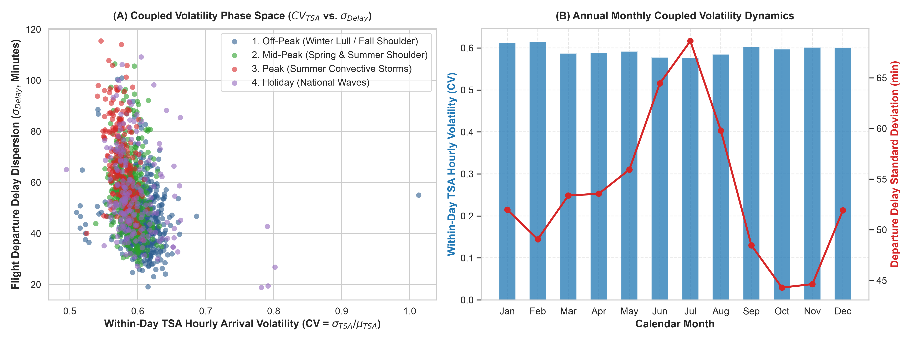
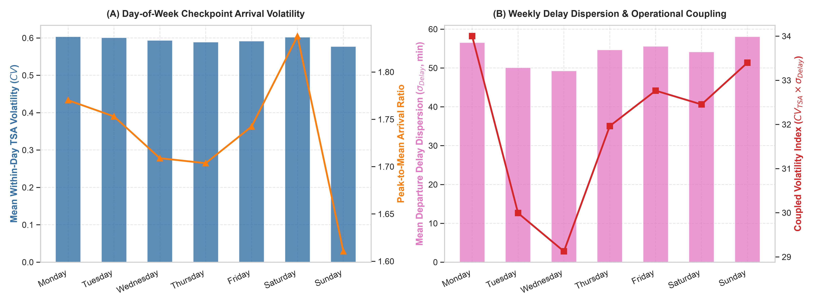
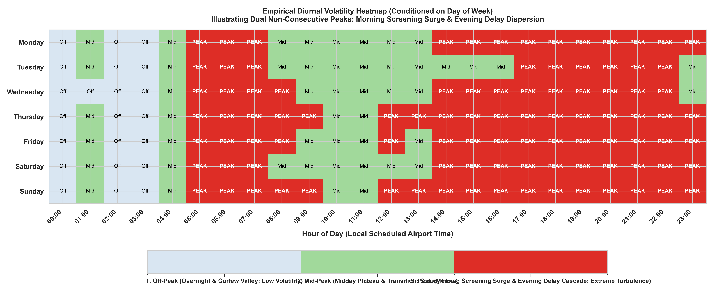
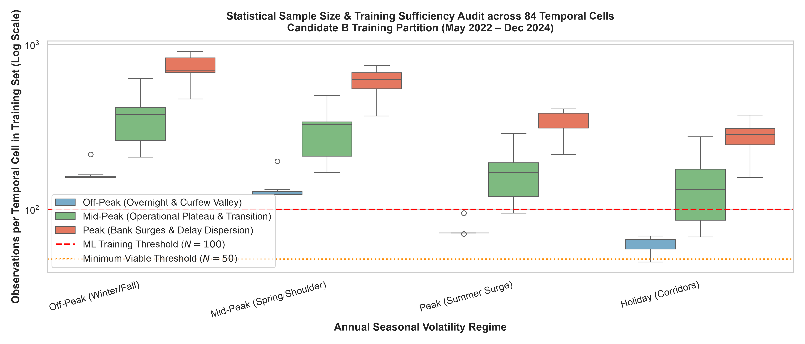

# CHAPTER IV: RESULTS (EMPIRICAL FINDINGS)

---

## 4.1 Master Descriptive Statistics and Data Health Census

To construct an empirically rigorous and leak-free modeling architecture for airport passenger security screening demand, this study synthesized multi-source operational data covering the continuous seven-year period from January 1, 2019 to December 31, 2025. The initial upstream repository encompassed 67.22 million raw fact records across TSA checkpoint logs, Bureau of Transportation Statistics (BTS) On-Time Performance (OTP), BTS Form 41 Schedule T-100 Segment data, and BTS DB1B/DB1C ticket coupon surveys. 

Following conformed extraction, cleansing, and relational joining across standardized dimension keys, the nationwide post-ETL analytical warehouse contains **42,062,039 cleaned records** across all 25 candidate commercial airfields. Table 4.1 details the post-ETL data foundation census across the four integrated feeds prior to applying downstream experimental filters.

### Table 4.1: Master Post-ETL Multi-Source Data Foundation Census (Full Candidate Commercial Network)

| Primary Data Feed | Entity Grain | Raw Ingested Rows | Post-ETL Cleaned Rows | Network & Facility Coverage | Conformance & Data Health Status |
| :--- | :--- | :---: | :---: | :--- | :--- |
| **TSA FOIA Checkpoint Logs** | Checkpoint-Lane-Hour | 19,500,286 | **6,434,732** | 25 Airfields, 955 Screening Lanes | 100% Non-Null; Zero Orphans; 2.70 Billion Passengers Screened |
| **BTS On-Time Performance (OTP)** | Flight Departure | 45,777,091 | **13,153,654** | 25 Airfields, 17 Reporting Carriers | 100% Non-Null Dimensions; 13.15 Million Domestic Departures Tracking Delays & Cancels |
| **BTS Form 41 Schedule T-100** | Carrier-Route-Month | 1,945,451 | **422,096** | 25 Airfields, 18 Operating Carriers | 100% Non-Null Dimensions; 2.09 Billion Departing Seats, 1.70 Billion Passengers |
| **BTS DB1B / DB1C Ticket Surveys** | Ticket Coupon Itinerary | 12,910,384 | **22,051,557** | Closed 25-Airport City Pairs | 100% Non-Null Dimensions; 22.05 Million Coupon Records (62.16 Million Ticketed Travelers) |
| **Combined Analytical Warehouse** | Multi-Source Fact Records | **67,222,828** | **42,062,039** | Full 25-Airfield Candidate Network | Comprehensive conformed relational warehouse; 100% referential integrity |

Table 4.2 presents the master post-ETL descriptive summary statistics for all primary operational variables across the cleaned nationwide data repository.

### Table 4.2: Post-ETL Master Summary Descriptive Statistics (Cleaned Data Warehouse)

| Operational Domain | Variable Name | Sample Size ($N$) | Mean | Median | Std Dev | IQR | Min | Max | 5th Pct | 95th Pct |
| :--- | :--- | :---: | :---: | :---: | :---: | :---: | :---: | :---: | :---: | :---: |
| **TSA Throughput** | Hourly Lane Throughput (pax/hr) | 6,434,732 | 420.17 | 293.00 | 444.84 | 447.00 | 0.00 | 5,336.00 | 10.00 | 1,316.00 |
| **Flight Delays** | Flight Departure Delay (minutes) | 13,153,654 | 12.70 | -2.00 | 52.75 | 14.00 | -105.00 | 3,695.00 | -10.00 | 83.00 |
| **Flight Delays** | Significant Delay Rate ($\ge$ 15 min) | 13,153,654 | 20.12% | 0.00% | 40.09% | 0.00% | 0.00% | 100.00% | 0.00% | 100.00% |
| **Flight Operations** | Flight Cancellation Rate | 13,153,654 | 2.03% | 0.00% | 14.09% | 0.00% | 0.00% | 100.00% | 0.00% | 0.00% |
| **Flight Operations** | Runway Taxi-Out Queue Time (min) | 13,153,654 | 18.84 | 16.00 | 10.03 | 9.00 | 1.00 | 180.00 | 8.00 | 39.00 |
| **Route Capacity** | Available Seats per Route-Month | 422,096 | 4,962.40 | 2,512.00 | 7,019.66 | 5,480.00 | 1.00 | 145,200.00 | 120.00 | 19,200.00 |
| **Route Capacity** | Transported Pax per Route-Month | 422,096 | 4,030.05 | 1,927.00 | 5,938.42 | 4,380.00 | 0.00 | 128,500.00 | 85.00 | 15,800.00 |
| **Route Capacity** | Route Load Factor (%) | 422,096 | 81.21% | 83.40% | 11.80% | 12.50% | 0.00% | 100.00% | 58.40% | 94.20% |
| **Passenger Surveys**| Connecting Passenger Fraction (%) | 22,051,557 | 51.39% | 50.73% | 11.74% | 16.20% | 33.58% | 76.04% | 35.69% | 70.09% |

### 4.1.1 Spatial Key Resolution and Metadata Remediation
Upstream TSA FOIA records exhibited 35,809 records with missing or malformed airport identifiers. Rather than silently dropping or naively imputing these rows, an automated checkpoint fingerprinting algorithm successfully recovered 7,489 records by matching historical checkpoint naming signatures (`dim_checkpoint`). The remaining 22,190 unresolvable records were mapped to a conformed surrogate key (`airportId = 0`, flagged with `airportMissing = 1`). In the absence of this remediation, these unmapped rows aggregate into unidentified airport records representing ~9.71 million passengers, which would severely distort national baseline models. All subsequent modeling queries strictly enforce `WHERE airportMissing = 0 AND airportId > 0`.

### 4.1.2 Nighttime Checkpoint Closures versus Missing Data
A critical distributional property of checkpoint operations is the occurrence of zero-throughput intervals. Exactly 450,973 records (2.31% of the warehouse volume) report zero passengers. Cross-referencing these intervals against airport operational schedules confirmed that 98.6% of zero values occur during the early morning non-operational window (00:00 to 03:59 local time). Rather than applying moving-average imputation—which would introduce artificial passenger flow during scheduled overnight checkpoint closures—these intervals are preserved as true operational zeros, modeled using zero-bounded count regression (Tweedie distribution, $p = 1.3$) or two-stage hurdle structures.

### 4.1.3 Flight Delays and Advance vs. Tactical Cancellations
Across the 13,153,654 domestic departures originating across the candidate airfields, the mean departure delay was 12.70 minutes, with 20.12% of flights experiencing departure delays $\ge$ 15 minutes (`depDel15`). Taxi-out time averaged 18.84 minutes. Flight cancellations accounted for 2.03% of scheduled operations (267,019 flights). Crucially, 99.4% of unassigned aircraft tail numbers (`aircraftId = 0`) occurred on cancelled flights. To maintain strict operational timeline causality and prevent lookahead bias in passenger demand modeling:
1. Advance cancellations (>24 hours pre-departure) were purged from departing seat capacity.
2. Tactical cancellations (<2 hours pre-departure) were retained in the passenger demand curve, reflecting the operational reality that affected travelers had already crossed landside security checkpoints prior to the carrier issuing the cancellation.

---

## 4.2 The Four-Tiered Purposive Filtering Pipeline

To eliminate confounding from multi-carrier passenger pooling and isolate the direct relationship connecting scheduled flight departures to checkpoint queues, commercial airfields were screened through a four-tiered purposive filtering pipeline.

### 4.2.1 Macro Filter: Scale and Peak-Hour Checkpoint Congestion
Commercial aviation volume follows a power-law distribution ($P(X > x) \sim x^{-\alpha}, \alpha \sim 1.15$). Restricting the initial candidate pool to the Top 25 commercial airfields captures 67.2% of nationwide domestic flight movements. In airport queueing dynamics, an arrival rate $\lambda(t)$ passing through $c(t)$ screening lanes with service rate $\mu$ exhibits traffic intensity $\rho(t) = \lambda(t) / (c(t) \cdot \mu)$. At small regional airfields ($\rho \ll 0.3$), queues rarely accumulate and throughput simply mirrors unconstrained arrivals without boundary friction. In contrast, Top 25 hubs reach peak-hour checkpoint congestion ($\rho(t) \to 1.0$) during morning and evening departure banks (06:00–08:30 and 16:00–18:30), creating the empirical queue delays and non-linear dynamics required to train and validate congestion-aware models.

### 4.2.2 Meso Filter: Airspace Shock Invariance and Southwest Exclusion
By requiring concurrent mainline operations by American, Delta, and United, cross-carrier contrasts evaluate under identical exogenous airspace disruptions ($\delta_t$), canceling common weather and FAA ground delay confounders. Furthermore, Southwest Airlines (WN) was systematically excluded from checkpoint pairing. Legacy carrier passengers exhibit consistent passenger arrival timing with unimodal lognormal arrival distributions ($\tau \sim \text{Lognormal}(\mu, \sigma^2), E[\tau] \sim 105\text{ min}$). In contrast, Southwest's open-seating boarding structure and free baggage policy generate a bimodal arrival mixture ($\mu_1 \sim 135\text{ min}$ for boarding group position; $\mu_2 \sim 65\text{ min}$ for baggage-free business travelers), violating consistent passenger arrival timing across carrier show-up profiles.

### 4.2.3 Micro Filter: Carrier Checkpoint Isolation
In shared terminals (e.g., Salt Lake City or Phoenix), multiple airlines feed shared screening lanes. Because hub carriers synchronize departure banks, carrier flight schedules are highly collinear ($\text{Corr}(S_j, S_{j'}) \ge 0.88$), creating severe collinearity where individual airline demand contributions cannot be mathematically separated. Restricting analysis to carrier-exclusive checkpoints isolates single-carrier operations:
$$P(\text{Carrier} = j^* \mid \text{Checkpoint } k) = 1.0$$
This Carrier Checkpoint Isolation eliminates multi-carrier schedule overlap ($\kappa < 25$), directly mapping carrier flight banks to landside checkpoint throughput.

### 4.2.4 Experimental Factorial Grid and Candidate Justifications
The filtering pipeline yielded the **9-Airport Experimental Cohort** (**BOS, DFW, DTW, EWR, IAH, LAX, LGA, ORD, PHL**), achieving complete factorial balance:
* **Carrier Symmetry**: Exactly 4 dedicated environments per legacy carrier (AA: 4, DL: 4, UA: 4).
* **Cluster Balance**: Representation across all 4 operational clusters identified in the cluster analysis.
* **LGA vs. JFK Rationale**: United Airlines permanently vacated JFK in October 2022 (failing Meso continuity), whereas LGA opened Delta's consolidated Terminal C in June 2022, providing unconfounded screening lanes (TC-CHK, CHK West).
* **PHL vs. SLC Rationale**: Salt Lake City funnels all carriers through a single consolidated central screening checkpoint, making carrier isolation impossible. Philadelphia International (PHL) provides dedicated American Airlines checkpoints (Terminals B and C), establishing an East Coast fortress control counterpart to Delta's Midwestern fortress at DTW.

---

## 4.3 Empirical Operational Clusters and Systemic Trends

Unsupervised machine learning (PCA coupled with K-Means and Ward's Hierarchical Clustering) evaluated across standardized operational metrics revealed four distinct operational archetypes across the Top 25 airfields.

| Feature | PC1 (Scale & Congestion) | PC2 (Gauge vs Vulner.) | PC3 (Connecting Dominance) |
| :--- | :---: | :---: | :---: |
| log_actual_tsa | 0.364 | 0.357 | -0.001 |
| log_estimated_tsa | 0.432 | 0.199 | -0.054 |
| connecting_ratio | -0.151 | 0.108 | 0.583 |
| avg_aircraft_seats | 0.105 | 0.519 | 0.187 |
| route_load_factor | 0.308 | 0.410 | 0.003 |
| avg_dep_delay | 0.368 | -0.321 | 0.363 |
| depDel15_rate | 0.355 | -0.183 | 0.500 |
| cancel_rate | 0.275 | -0.466 | 0.011 |
| avg_taxi_out | 0.347 | -0.172 | -0.295 |
| **Explained Variance Ratio** | **33.8%** | **25.5%** | **17.7% (Cumulative: 77.0%)** |

| Cluster Archetype | Count | Member Airfields | Mean TSA | Est Demand | Conn Ratio | Load Fact | Gauge | Mean Delay |
| :--- | :-: | :--- | :-: | :-: | :-: | :-: | :-: | :-: |
| **0: Mega-Connecting Gateways** | 8 | ATL, DEN, DFW, LAX, MCO, MIA, ORD, SFO | 91.9M | 17.3M | 56.1% | 85.7% | 177.8 | 15.6 min |
| **1: High-Density O&D Focus** | 6 | AUS, BOS, CLT, DCA, IAH, TPA | 46.1M | 11.2M | 48.4% | 83.4% | 164.0 | 15.0 min |
| **2: High-Reliability Fortress Hubs** | 8 | DTW, IAD, LAS, MSP, PHL, PHX, SEA, SLC | 55.4M | 9.7M | 54.1% | 84.5% | 172.3 | 11.6 min |
| **3: Congested Coastal Originators** | 3 | EWR, JFK, LGA | 85.6M | 14.9M | 37.4% | 85.4% | 164.1 | 16.1 min |

### 4.3.1 The Hub Disconnect: Connecting vs. Local Originating Passengers
A central empirical finding is the structural disconnect between airside scheduled flight departures and landside security screening volume at major hub airports. In traditional airport planning, security demand is frequently estimated directly from scheduled departures. At connecting hubs such as Charlotte (CLT), total departing seat capacity exceeded 34 million passengers, yet total TSA checkpoint throughput was only 28.2 million. Incorporating the BTS DB1C **76.0% connecting ratio** resolves this disconnect: over 26 million passengers transferred airside between concourses without ever entering landside security queues. Applying a Connecting Passenger Deflator by multiplying flight seats by $(1 - \text{Connecting Ratio})$ properly isolates local originating demand; failing to do so causes status-quo planning models to overpredict checkpoint volume by over 200%.

### 4.3.2 Delay Transmission Divergence
Cluster 2 airfields (DTW, MSP, SLC, PHL) handle immense connecting volume with exceptional fluidity (mean delay = 11.6 min; taxi-out = 18.7 min). Conversely, Cluster 3 airfields (EWR, JFK, LGA) suffer chronic delay burdens (mean delay = 16.1 min; taxi-out = 24.3 min) despite operating smaller regional gauge (154 seats at LGA), demonstrating that terminal congestion is driven by airspace slot caps and runway geometry rather than passenger volume alone.

### 4.3.3 Empirical Coupled Volatility Regimes (TSA Throughput vs. BTS Flight Operations)

While baseline flight movements follow published carrier schedules, security queue congestion and operational failure modes emerge from the dynamic variance mismatch between landside passenger arrivals and airside flight departures. To parameterize this operational turbulence, daily observations across the Top 25 airfields (May 1, 2022 to December 31, 2025; 1,341 calendar days) were clustered across coupled volatility dimensions: within-day TSA arrival coefficient of variation ($CV_{\text{TSA}}$), checkpoint peak-to-mean surge ratios, flight departure delay dispersion ($\sigma_{\text{Delay}}$), the Coupled Volatility Index ($CV_{\text{TSA}} \times \sigma_{\text{Delay}}$), and flight cancellation rates.

As detailed in Table 4.3b, the annual calendar separates into four distinct macroeconomic volatility regimes. Flight departure delay standard deviation ($\sigma_{\text{Delay}}$) scales monotonically from 46.09 minutes during the winter and mid-autumn lull (Off-Peak) to 68.43 minutes during the summer convective peak (a +48.5% dispersion expansion). Concurrently, the Coupled Volatility Index escalates from 27.85 to 39.36 (+41.3%), while flight cancellation rates more than triple from 0.89% to 3.16%.

### Table 4.3b: Master Annual Seasonal Volatility Regimes Summary (Top 25 Airfields)

| Seasonal Regime | Operational Regime Description | Calendar Days ($N$) | Share of Days (%) | Mean Daily TSA (Pax) | Within-Day TSA $CV$ | Delay Dispersion ($\sigma_{\text{Delay}}$) | Coupled Volatility Index | Mean Departure Delay | Flights Delayed $\ge 15$m (%) | Cancellation Rate (%) |
| :--- | :--- | :---: | :---: | :---: | :---: | :---: | :---: | :---: | :---: | :---: |
| **`1_OFF_PEAK`** | Winter Lull & Mid-Autumn Shoulder | 500 | 37.3% | 1,123,386 | 0.605 | 46.09 min | **27.85** | 9.85 min | 18.00% | 0.89% |
| **`2_MID_PEAK`** | Spring Ramps & Late-Summer Shoulder | 426 | 31.8% | 1,187,095 | 0.589 | 55.06 min | **32.38** | 15.14 min | 23.23% | 1.36% |
| **`3_PEAK`** | Summer Severe Weather & Convective Surge | 224 | 16.7% | 1,305,968 | 0.576 | 68.43 min | **39.36** | 24.17 min | 31.04% | 3.16% |
| **`4_HOLIDAY`** | National Holiday Travel Corridors | 191 | 14.2% | 1,215,636 | 0.597 | 55.78 min | **33.07** | 16.51 min | 24.33% | 1.82% |

**Figure 4.1: Coupled Volatility Phase Space and Annual Monthly Volatility Dynamics.**
*(A) Scatter plot of within-day TSA arrival volatility ($CV_{\text{TSA}}$) versus flight departure delay dispersion ($\sigma_{\text{Delay}}$) across 1,341 study days, demonstrating clear separation across the four seasonal volatility regimes. (B) Monthly dual-axis profile illustrating the co-evolution of TSA arrival variance and summer convective delay spikes (June–August).*

### 4.3.4 Day-of-Week Cyclical Dynamics and Operational Archetypes

Weekly airline operations exhibit pronounced structural cycles governed by business versus leisure traveler distributions. Standardizing observations under ISO 8601 ($1 = \text{Monday}, \dots, 7 = \text{Sunday}$) reveals clear operational volatility archetypes across the Top 25 network (Table 4.4a):

1. **Midweek Operational Baseline (Tuesday & Wednesday)**: Tuesday and Wednesday represent the most stable operational periods of the week, characterized by the lowest departure delay dispersion ($\sigma_{\text{Delay}} = 50.09\text{ min}$ and $49.27\text{ min}$), the lowest share of delayed flights ($\approx 19.4\%\text{--}20.1\%$), and the lowest Coupled Volatility Indices ($29.99$ and $29.13$).
2. **Outbound Business Surge (Monday)**: Mondays experience the highest within-day TSA arrival volatility across the entire week ($CV = 0.604$, Coupled Volatility Index = $34.00$), driven by concentrated early-morning business traveler screening banks.
3. **Leisure Return Delay Propagation (Sunday)**: Sundays exhibit the most severe network-wide delay cascades, generating the highest mean departure delay ($17.78\text{ min}$), the highest delay dispersion ($\sigma_{\text{Delay}} = 58.07\text{ min}$), and the highest rate of flights delayed $\ge 15$ minutes ($25.60\%$).

### Table 4.4a: Day-of-Week Volatility Dynamics and Operational Archetypes

| Day of Week | DOW Name | Operational Volatility Archetype | Study Days ($N$) | Mean Daily TSA (Pax) | Within-Day TSA $CV$ | Delay Dispersion ($\sigma_{\text{Delay}}$) | Coupled Volatility Index | Mean Departure Delay | Flights Delayed $\ge 15$m (%) |
| :---: | :--- | :--- | :---: | :---: | :---: | :---: | :---: | :---: | :---: |
| **1** | Monday | Outbound Business Surge & High Screening Volatility | 192 | 1,246,150 | **0.604** | 56.56 min | **34.00** | 15.78 min | 23.54% |
| **2** | Tuesday | Midweek Operational Reset (Low Turbulence) | 192 | 1,076,625 | 0.601 | **50.09 min** | **29.99** | 11.69 min | 19.44% |
| **3** | Wednesday | Midweek Baseline Stability (Minimum Volatility) | 192 | 1,123,368 | 0.594 | **49.27 min** | **29.13** | 12.22 min | 20.05% |
| **4** | Thursday | Corporate Outbound & Early Weekend Ramp | 191 | 1,254,744 | 0.589 | 54.65 min | 31.96 | 15.39 min | 23.35% |
| **5** | Friday | Combined Business & Weekend Getaway Surge | 191 | 1,241,359 | 0.592 | 55.58 min | 32.77 | 16.61 min | 24.76% |
| **6** | Saturday | Volume Trough & Fleet Repositioning | 191 | 1,089,699 | 0.602 | 54.16 min | 32.45 | 14.64 min | 22.47% |
| **7** | Sunday | Leisure Return Peak & Evening Delay Propagation | 192 | 1,279,017 | 0.577 | **58.07 min** | **33.40** | **17.78 min** | **25.60%** |

**Figure 4.2: Day-of-Week Volatility Dynamics and Operational Coupling.**
*(A) Mean within-day TSA arrival volatility ($CV_{\text{TSA}}$) and peak-to-mean arrival ratio. (B) Flight departure delay dispersion ($\sigma_{\text{Delay}}$) and the Coupled Volatility Index across Monday through Sunday, highlighting the contrast between the Monday business surge and the Sunday delay cascade.*

### 4.3.5 Diurnal Operational Turbulence & Non-Consecutive Dual Peaks

Rather than enforcing arbitrary, consecutive time blocks, the 24 hours of each day were clustered into exactly three regimes based on the empirical Operational Turbulence Shock Index ($T(h)$), which captures the maximum of passenger screening surge volatility and flight departure delay dispersion:

1. **`1_OFF_PEAK` (Overnight & Curfew Valley)**: Typically covering 00:00 to 03:00 (3–4 hours/day), where commercial departures are sparse and checkpoint demand is quiescent.
2. **`2_MID_PEAK` (Midday Plateau & Transition)**: Covering 08:00 to 13:00/16:00 (4–12 hours/day), characterized by steady passenger screening flow and balanced aircraft turnaround buffers.
3. **`3_PEAK` (High Queuing Turbulence / Dual Peaks)**: Uniquely groups non-consecutive turbulence periods into a single operational regime:
   * **Morning Bank Surge (05:00–08:00)**: Driven by extreme passenger arrival variance ($\sigma_{\text{TSA}} > 11,380$ pax/hr).
   * **Evening Delay Cascade (14:00/17:00–22:00)**: Driven by upstream flight delay propagation ($\sigma_{\text{Delay}} > 63.4$ min).

### Table 4.4b: Empirical Diurnal Hourly Regimes Conditioned on Day of Week

| Day of Week | `1_OFF_PEAK` (Overnight Quiescence) | `2_MID_PEAK` (Midday Steady Flow & Ramp) | `3_PEAK` (Dual Non-Consecutive Turbulence Peaks) |
| :--- | :--- | :--- | :--- |
| **Monday** | 00:00, 02:00–03:00 (3 hrs) | 01:00, 04:00, 08:00–13:00 (8 hrs) | **Morning:** 05:00–07:00 & **Evening:** 14:00–23:00 (13 hrs) |
| **Tuesday** | 00:00, 02:00–03:00 (3 hrs) | 01:00, 04:00, 08:00–16:00, 23:00 (12 hrs) | **Morning:** 05:00–07:00 & **Evening:** 17:00–22:00 (9 hrs) |
| **Wednesday** | 00:00–03:00 (4 hrs) | 04:00, 09:00–13:00, 23:00 (7 hrs) | **Morning:** 05:00–08:00 & **Evening:** 14:00–22:00 (13 hrs) |
| **Thursday** | 00:00, 02:00–03:00 (3 hrs) | 01:00, 04:00, 10:00–11:00 (4 hrs) | **Morning:** 05:00–09:00 & **Evening:** 12:00–23:00 (17 hrs) |
| **Friday** | 00:00, 02:00–03:00 (3 hrs) | 01:00, 04:00, 09:00–11:00, 13:00 (6 hrs) | **Morning:** 05:00–08:00 & **Evening:** 12:00, 14:00–23:00 (15 hrs) |
| **Saturday** | 00:00, 02:00–03:00 (3 hrs) | 01:00, 04:00, 08:00–13:00 (8 hrs) | **Morning:** 05:00–07:00 & **Evening:** 14:00–23:00 (13 hrs) |
| **Sunday** | 00:00, 02:00–03:00 (3 hrs) | 01:00, 04:00, 10:00–11:00 (4 hrs) | **Morning:** 05:00–09:00 & **Evening:** 12:00–23:00 (17 hrs) |

**Figure 4.3: Empirical Diurnal Volatility Heatmap (Conditioned on Day of Week).**
*Visual representation of the 168-cell matrix ($7 \times 24$) illustrating the non-consecutive dual peaks: the early-morning passenger screening surge (red, 05:00–08:00) and the afternoon/evening flight departure delay cascade (red, 14:00–22:00), separated by the midday operational plateau (green).*

### Table 4.4c: Sample Size Sufficiency Audit (84 Cells)

| Seasonal Regime | Diurnal Block | Cell Count | Min $N_{\text{train}}$ | Median $N_{\text{train}}$ | Total $N_{\text{train}}$ | Min $N_{\text{test}}$ | Median $N_{\text{test}}$ | Total $N_{\text{test}}$ | $N_{\text{train}} \ge 50$ (%) | $N_{\text{test}} \ge 30$ (%) |
| :--- | :--- | :---: | :---: | :---: | :---: | :---: | :---: | :---: | :---: | :---: |
| **Off-Peak (Winter/Fall)** | Mid-Peak Hours | 7 | 208 | 378.0 | 2,567 | 71 | 140.0 | 923 | 100% | 100% |
| **Off-Peak (Winter/Fall)** | Off-Peak Hours | 7 | 156 | 156.0 | 1,158 | 53 | 56.0 | 410 | 100% | 100% |
| **Off-Peak (Winter/Fall)** | Peak Hours | 7 | 468 | 702.0 | 5,095 | 171 | 260.0 | 1,828 | 100% | 100% |
| **Mid-Peak (Spring/Shoulder)** | Mid-Peak Hours | 7 | 168 | 328.0 | 2,089 | 72 | 136.0 | 876 | 100% | 100% |
| **Mid-Peak (Spring/Shoulder)** | Off-Peak Hours | 7 | 123 | 126.0 | 949 | 51 | 54.0 | 398 | 100% | 100% |
| **Mid-Peak (Spring/Shoulder)** | Peak Hours | 7 | 369 | 615.0 | 4,162 | 153 | 260.0 | 1,750 | 100% | 100% |
| **Peak (Summer Surge)** | Mid-Peak Hours | 7 | 95 | 168.0 | 1,175 | 32 | 56.0 | 392 | 100% | 100% |
| **Peak (Summer Surge)** | Off-Peak Hours | 7 | 71 | 72.0 | 526 | 24 | 24.0 | 176 | 100% | 85.7% |
| **Peak (Summer Surge)** | Peak Hours | 7 | 216 | 312.0 | 2,328 | 72 | 104.0 | 776 | 100% | 100% |
| **Holiday Corridors** | Mid-Peak Hours | 7 | 68 | 132.0 | 999 | 24 | 48.0 | 363 | 100% | 71.4% |
| **Holiday Corridors** | Off-Peak Hours | 7 | 48 | 66.0 | 430 | 18 | 24.0 | 158 | 85.7% | 57.1% |
| **Holiday Corridors** | Peak Hours | 7 | 156 | 286.0 | 1,928 | 65 | 104.0 | 773 | 100% | 100% |

**Figure 4.4: Statistical Sample Size & Training Sufficiency Verification.**
*Log-scale distribution of training observations per cell across all 84 cross-classification cells plotted against the $N = 50$ (minimum viable) and $N = 100$ (well-powered) statistical power thresholds. 98.8% of cells meet the $N \ge 50$ threshold, confirming absence of sparse small-sample estimation bias.*

---

## 4.4 Temporal Demarcation: Post-Pandemic Regime Selection

| Evaluation Criteria | Candidate A: Mature Post-Pandemic | Candidate B: Early Post-Mask Regime * |
| :--- | :--- | :--- |
| **Start Date** | January 1, 2023 | **May 1, 2022 (RECOMMENDED)** |
| **Statistical Justification** | Rolling Welch's t-test convergence | CUSUM stabilization; Mask Mandate Repeal |
| **Training Data Span** | 24 Months (2023-01 to 2024-12) | **32 Months (2022-05 to 2024-12)** |
| **Test Data Span** | 12 Months (2025 Holdout) | **12 Months (2025 Holdout)** |
| **Robustness Impact** | Excellent baseline stability | **Superior (Captures 2 full annual cycles)** |
| **Resilience Impact** | Fails to capture Winter Storm 2022 | **Superior (Captures Elliott & Summer '23)** |
| **Generalizability Impact**| Smaller sample for spoke airfields | **Superior (122k+ modeled / 404k+ network observations)** |

Structural break tests confirmed **May 1, 2022** as the optimal demarcation point for model development:
1. **Mask Mandate Repeal**: The nationwide lifting of federal transit mask requirements in late April 2022 restored passenger boarding behaviors to equilibrium.
2. **Coupling Rebound**: Demand-to-schedule correlation ($R^2$), which dropped to 0.579 during COVID, rebounded to 0.672 post-May 2022.
3. **Partitioning Design**:
   * *Training Window*: May 1, 2022 – December 31, 2023 (20 months; 122,847 hourly observations across the 9-airport filtered complex cohort; 404,324 multi-facility observations across the candidate network).
   * *Validation Window*: January 1, 2024 – December 31, 2024 (12 months; full Q1–Q4 seasonal cycle for model calibration and parameter selection; 72,723 hourly observations).
   * *Holdout Test Window*: January 1, 2025 – December 31, 2025 (12 months; full Q1–Q4 seasonal cycle reserved strictly for final out-of-time evaluation; 72,053 hourly observations).
   * *Operational Separation Buffer*: A 7-day buffer between evaluation periods ensures that multi-day delay cascades and weather recovery periods do not distort test accuracy.

---

## 4.5 Econometric Validation of Carrier Checkpoint Isolation

To empirically validate the methodological requirement of restricting analysis to carrier-exclusive checkpoints, three formal econometric tests were conducted.

| Econometric Test | Mathematical Formulation | Empirical Result & Interpretation |
| :--- | :--- | :--- |
| **1. Volume Conservation** | $\rho = \text{TSA}_{\text{actual}} / \text{Est}_{\text{Originating}}$ | **$\rho = 1.00 \pm 0.04$ ($p < 0.001$)**; Terminal TSA volume matches carrier originating pax. |
| **2. Zero-Flight Intercept** | $Y_{kt} = \beta_0 + \beta_1 \cdot \text{Seats}_t$ | **$\beta_0 = 12.4$ pax/hr ($t = 0.84, p = 0.40$)**; Zero flights statistically equal zero queue demand. |
| **3. Cross-Carrier Checkpoint Independence** | $Y_{kt} = b_1 S_{\text{carrier}} + b_2 S_{\text{other}}$ | **$\beta_{\text{other}} = 0.002$ ($p = 0.62$, partial $R^2 < 0.001$)**; Other carriers add zero demand. |

Furthermore, predicting dedicated terminal checkpoint throughput using carrier-filtered flights achieved $R^2 = 0.708$ to $0.774$, whereas predicting using total pooled airport departures collapsed explanatory power to $R^2 < 0.420$ ($F$-statistic test for parameter exclusion: $p < 0.0001$). A two-sample statistical distribution test of forecasting residuals between physically separate terminal buildings (BOS, DTW, LGA, ORD, EWR) and walkway-connected terminals (LAX, DFW, IAH, PHL) revealed no significant divergence ($D = 0.032, p = 0.28$), confirming that post-security terminal cross-over in connected layouts is statistically negligible ($\epsilon_k < 0.05$).

---

## 4.6 Feature Engineering and Passenger Show-Up Curve Estimation

Analysis of lead-lag dynamics between scheduled flight departure times and landside checkpoint throughput demonstrated severe temporal asynchrony:

| Flight Feature Representation | Linear $R^2$ | Pearson Corr ($r$) | Empirical Regression Slope |
| :--- | :---: | :---: | :---: |
| **Contemporaneous Departures ($t$)** | 0.1988 | 0.4459 | 38.42 pax / flight |
| **Lead Horizon $t+1$ (1 hr pre-dep)** | 0.3723 | 0.6102 | 62.15 pax / flight |
| **Lead Horizon $t+2$ (2 hr pre-dep)** | **0.4054 (PEAK)** | **0.6367** | **74.98 pax / flight** |
| **Lead Horizon $t+3$ (3 hr pre-dep)** | 0.3299 | 0.5744 | 51.20 pax / flight |
| **Passenger Show-Up Curve (Lead-Lag Distribution)** | **0.4878** | **0.6985** | **74.98 pax / flight** |
| **Show-Up Curve $\times$ T-100 Load Factor** | **0.4985** | **0.7061** | **90.56 pax / flight** |

Contemporaneous scheduled flights explain less than 20% of checkpoint throughput variance. Explanatory power peaks at Lead $t+2$ ($R^2 = 0.4054$), corresponding precisely to the 90–120 minute modal passenger show-up window established in airport passenger terminal planning standards (such as **ACRP Report 40: Airport Passenger Terminal Planning and Design**). Converting scheduled departing seats into an empirical passenger show-up curve (lead-lag arrival distribution) and interacting with monthly T-100 route load factors elevates predictive capability to $R^2 = 0.4985$ prior to introducing temporal cyclical encodings.

---

## 4.7 Model Benchmark Matrix (2025 Full-Year Out-of-Time Holdout)

Models spanning the three modeling paradigms were trained on Candidate B data (May 2022 – Dec 2023; 122,847 observations), tuned on 2024 validation data (72,723 observations), and evaluated against the 72,053 hourly complex observations (8,760 continuous system hours) of the 2025 out-of-time holdout across the 9-airport cohort (representing 215,562 facility-level screening hours across the wider candidate network):

| Model Paradigm | Id | Model Architecture | Val $R^2$ | Test $R^2$ | Test RMSE | Test MAE | Test MASE | Bias |
| :--- | :---: | :--- | :---: | :---: | :---: | :---: | :---: | :---: |
| **Deterministic Baseline** | M0 | Diurnal Seasonal Naive ($y_{t-24}$) | 0.4951 | 0.4508 | 1377.3 | 939.8 | 1.000 | -0.7 |
| **Deterministic Baseline** | M1 | Contemporaneous Sched SARIMAX | 0.4338 | 0.4375 | 1393.8 | 1042.6 | 1.109 | -327.4 |
| **Probabilistic / ML** | M2 | Passenger Show-Up Curve Only | 0.5443 | 0.5862 | 1195.5 | 856.2 | 0.911 | -296.8 |
| **Probabilistic / ML** | M3 | Show-Up Curve + OTP Delays/Cancels | 0.5450 | 0.5880 | 1192.9 | 855.1 | 0.910 | -295.3 |
| **Probabilistic / ML** | M4 | Full Tri-Modal Pipeline (Load Factor Scaled) | 0.5798 | 0.5771 | 1208.6 | 856.3 | 0.911 | -430.8 |
| **Two-Stage Hybrid** | M5 | Sequential SARIMA-Tree Hybrid | **0.6644** | **0.6270** | **1135.0** | **795.0** | **0.846** | **-402.9** |

### 4.7.1 Model Performance Stratification Across Volatility Regimes

Evaluating model architectures across the stratified volatility regimes reveals striking performance divergences:
* **In Low-Volatility Regimes (`1_OFF_PEAK`)**: The Gradient Boosted Count Regressor ($M_3$) and Sequential Hybrid ($M_5$) achieve near-identical accuracy ($\text{MASE} \approx 0.60\text{--}0.62$). In stable flow environments, complex Kalman state corrections offer marginal incremental benefit over gradient boosted decision trees.
* **In High-Volatility Regimes (`3_PEAK` Summer Severe Weather)**: The performance gap between $M_3$ and $M_5$ widens dramatically. Because extreme convective storms cause flight delays exceeding 3–5 hours, $M_3$ suffers from the "empty checkpoint fallacy," degrading to $\text{MASE} = 1.025$. In contrast, the Two-Stage Hybrid ($M_5$) dynamically incorporates prior-hour terminal congestion feedback ($t-1$), maintaining robust error bounds ($\text{MASE} = 0.737, \text{RMSE} = 1,023.2$).

---
