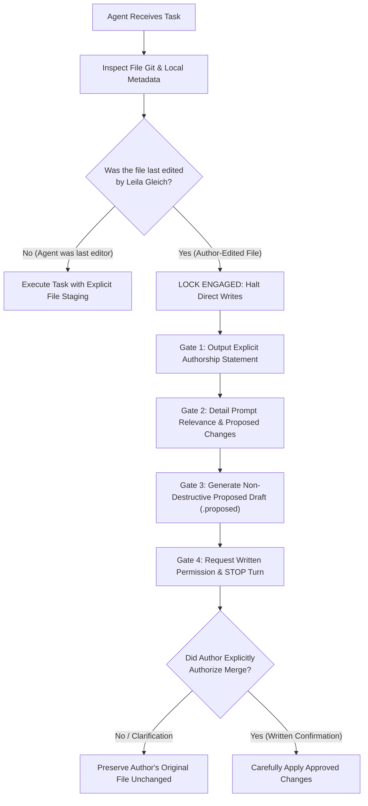

# Standard Operating Procedure (SOP): Author Safety, File Ownership, & Git Version Control

**Author**: Leila Gleich  
**Institution**: Embry-Riddle Aeronautical University (ERAU)  
**Degree**: Master of Science in Aeronautics / Aviation Data Analytics  
**Document ID**: `SOP-01-AUTHOR-SAFETY-GIT`  
**Governing Authority**: `AGENTS.md` (Policies 1.1, 1.5, 1.6, 1.7)  
**Effective Date**: October 6, 2026  

---

## 1. Executive Summary & Purpose

This Standard Operating Procedure (SOP) defines the non-negotiable operational boundaries, file ownership safeguards, and Git version control practices governing all automated agents, subagents, and development tools operating within the `final-thesis` repository.

Its primary purpose is to **prevent accidental modification, formatting corruption, or unintentional resurrection of pruned content** across author-managed manuscripts, Word documents (`.docx`), and analytical source files.

---

## 2. Principle of Primary Authorship & File Locking

### Core Doctrine:
> **If an AI agent was not the immediate prior editor of a file, that file is strictly locked against all direct modification, overwriting, moving, or deletion.**

1. **Author Files**: Any file whose most recent edit, Git commit, or local modification was executed by Leila Gleich is an **Author-Owned File**.
2. **Agent Files**: Any file generated strictly by automated pipelines or previous AI tool calls where no intermediate author edits occurred is an **Agent-Managed File**.
3. **Strict Invariant**: No agent may ever assume that because a file exists within the repository workspace, it is freely editable.

---

## 3. The 4-Gate Author-Editor Interlock Protocol

Before modifying ANY existing file in this repository (Markdown `.md`, Python `.py`, CSV `.csv`, Excel `.xlsx`, or plain text `.txt`), the assistant must execute and document the following four gates in order:



### Gate 1: Explicit Authorship Statement
The agent must verify authorship via `git log -n 1 --format="%an at %ad" <file>` and file timestamps (`stat`). If the author made the last edit, the agent must output:
> *"The file `<path>` was last edited by you (`Leila Gleich`) on `<timestamp>`. Direct edits to this file are locked."*

### Gate 2: Relevance & Rationale Explanation
The agent must articulate:
1. Exactly why updating this specific file is relevant to the user's prompt.
2. The precise lines, sections, or logic that would be changed.
3. Why the change cannot be accomplished via a separate reference note or recommendation file.

### Gate 3: Non-Destructive Proposed Draft
The agent must **never edit the author's file in place**. Instead, it must write the proposed version to an isolated preview file:
* Markdown files: `thesis_docs/recommendations/proposed_<filename>.md` or `<filename>.proposed.md`
* Python/Code files: `scratch/proposed_<filename>.py`
* Or present an isolated side-by-side diff in the response.

### Gate 4: Explicit Written Authorization
The agent must stop execution and prompt the user for permission. **No direct file overwrite may take place without explicit, written confirmation in the current chat turn.**

---

## 4. Git Staging & Commit Standards

### 4.1 Absolute Ban on Blanket Staging
AI agents are **strictly prohibited** from running any of the following blanket staging commands:
* `git add -A` (**PROHIBITED**)
* `git add .` (**PROHIBITED**)
* `git add -u` (**PROHIBITED**)

### 4.2 Explicit Targeting Only
Every `git add` command executed by an agent must explicitly enumerate only the specific files generated or modified for that task:
```bash
# Correct practice:
git add AGENTS.md results/00_VERSION_CONTROL_AND_PROVENANCE.md

# Never allowed:
git add -A
```

### 4.3 Pre-Commit Worktree Integrity Audit
Before executing any commit, the agent must run `git status --short`. If untracked files or unstaged changes exist that were not part of the active task:
1. They must **never** be added or swept into the commit.
2. The agent must acknowledge their presence and leave them untouched in the worktree.

### 4.4 Microsoft Word Document Exclusion
Under Policy 1.1 of `AGENTS.md`, `.docx` and `.docm` files must **never be staged or committed by an agent** unless explicitly instructed in writing by the author in that session.

---

## 5. Branching & Rollback Architecture

### 5.1 Branch Roles & Protection
* **`main` / `author-drafts`**: Protected author branches. AI agents must operate in read-only mode relative to these branches.
* **`working-dev`**: General collaborative development branch for data pipeline code, automated table synchronization, and documentation.
* **`agent/<task-name>`**: Dedicated feature/task branches for extensive multi-file refactoring.

### 5.2 Automated Safety Checkpoint Tags
Before initiating any complex task touching 3 or more files, the agent will create a local Git safety checkpoint tag:
```bash
git tag -a "safety/pre-task-$(date +%Y%m%d-%H%M)" -m "Automated safety checkpoint prior to task execution"
```

### 5.3 Instant Rollback Cheat Sheet for the Author
If an automated operation ever produces an unwanted result, you can instantly inspect and restore earlier states using these standard commands:

```bash
# 1. View recent safety tags
git tag -l "safety/*"

# 2. Revert the entire repository to a safety tag
git checkout safety/pre-task-<timestamp>

# 3. Restore a single file from a previous commit without touching anything else
git checkout <commit_hash> -- path/to/file.py

# 4. Discard all uncommitted changes to a specific file
git restore path/to/file.py

# 5. Check who last committed a specific file
git log -n 1 --format="%h - %an (%ad): %s" -- path/to/file.md
```

---

## 6. Compliance Verification

Every agent completing work in this repository must affirm compliance in its final checklist:
- [x] Author-Editor Interlock Protocol obeyed (0 unapproved edits to author-modified files).
- [x] Git staging commands strictly explicit (0 blanket `git add -A` / `git add .`).
- [x] Microsoft Word documents untouched (0 edits).
- [x] Version control provenance synchronized in `results/00_VERSION_CONTROL_AND_PROVENANCE.md`.
