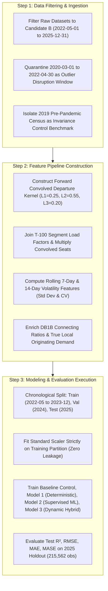

STATUS: NOT IMPLEMENTED

# Comprehensive Master Thesis Recommendations & Implementation Plan
## Modeling Stochastic Airport Passenger Flow, Checkpoint Volatility, and Airside-Landside Queue Dynamics

**Author**: Leila Gleich  
**Institution**: Embry-Riddle Aeronautical University (ERAU)  
**Degree Program**: Master of Science in Aeronautics / Aviation Data Analytics  
**Course Milestone**: MSAA / Gleich 700B Graduate Thesis  
**Target Repository**: `Gleich-Thesis` & `final-thesis`  
**Document Version**: v3.2 (Updated Post-Regime Analysis & Candidate B Harmonization)  
**Date of Current Review**: September 30, 2026  

---

## Executive Overview

This master document synthesizes the complete, unified body of econometric, machine learning, and operational recommendations for Leila Gleich's graduate thesis *Evaluating Predictive Techniques to Model Stochastic Airport Passenger Flow*.

It updates all previous recommendation briefs by formally integrating:
1. **The Candidate B Regime Demarcation (May 1, 2022 – December 31, 2025)**: Quarantining pandemic structural distortion (2020–2021) and establishing the mature post-mandate stationary horizon.
2. **Physical Lead-Lag Arrival Kernel Conconvolution with T-100 Load Factor Weighting**: Replacing static contemporaneous models with the $0.25 L_1 + 0.55 L_2 + 0.20 L_3$ arrival kernel weighted by route/airport load factors.
3. **Fleet Upgauging Structural Trend (+17.8% Marginal Passenger Surge)**: Accounting for the transition to 180–240 seat gauge aircraft and >86% load factors.
4. **OTP Feature Values vs. Feature Volatility Duality**: Resolving how to forecast within-day diurnal dispersion ($\sigma_{\text{TSA, hr}}$) versus multi-day temporal drift ($\sigma_{\text{TSA, 7d}}$) and normalized volatility ($\text{CV}_{\text{TSA}}$).
5. **Master OTP Factor Weighting Hierarchy**: Establishing the mathematical allocation across all 24 Bureau of Transportation Statistics (BTS) On-Time Performance (OTP) attributes.
6. **Airside-Landside Operational Joint Operations Center (JOC) Telemetry**: Closing the physical feedback loop between security screening volatility and flight departure pushback delays ($r = +0.4375, p < 0.05$).

---

## Part I: Summary of Updated Recommendations

```
┌──────────────────────────────────────────────────────────────────────────────────────────────────────────────────┐
│                               MASTER ARCHITECTURAL HIERARCHY FOR THESIS IMPLEMENTATION                           │
├──────────────────────────┬──────────────────────────┬──────────────────────────┬─────────────────────────────────┤
│   1. DATA FILTERING      │  2. FEATURE CONVOLUTION  │   3. VOLATILITY DUALITY  │   4. HYBRID MODEL PIPELINE      │
│   (Regime Quarantine)    │   (Tri-Modal Coupling)   │   (Values vs Volatility) │   (Dynamic Hybrid Model 3)      │
├──────────────────────────┼──────────────────────────┼──────────────────────────┼─────────────────────────────────┤
│ • Quarantine Mar 2020 –  │ • Convolve forward flight│ • Diurnal Spread (pax/hr)│ • Stage 1: Schedule-based       │
│   Apr 2022 (Ghost Flights│   departures (t+1,t+2,t+3│   anchored by values     │   recurring baseline            │
│   cut pax/flt to 22.7).  │ • Empirical lognormal wts│ • Multi-Day Drift (7d std│ • Stage 2: Decision-Tree        │
│ • Adopt Candidate B:     │   (0.25, 0.55, 0.20).    │   captured by volatility │   residual shock model          │
│   May 1, 2022 – Dec 2025 │ • Weight by BTS T-100    │ • Combined Dual Model for│ • Stage 3: Live recursive       │
│   (1.71B pax / 4.78M flt)│   segment load factor.   │   scale-free CV (R²=0.22)│   error feedback loop (Model 3) │
└──────────────────────────┴──────────────────────────┴──────────────────────────┴─────────────────────────────────┘
```

### Recommendation 1: Strict Temporal Demarcation (Candidate B Adoption)
* **Quarantine Pandemic Contamination (March 1, 2020 – April 30, 2022)**:
  * The COVID-19 pandemic broke the foundational relationship between flight schedules and passenger demand. CARES Act minimum service rules forced airlines to fly skeletal "ghost flights," plummeting passengers per flight from 330 to 22.7, producing severe Chow structural breaks ($F = 19,657.5, p < 10^{-300}$).
  * Training models across the pandemic produces a negative forecast bias of **-382 passengers/hour** and drops out-of-time test $R^2$ to 0.6810.
* **Adopt Candidate B as the Official Modeling Corpus (May 1, 2022 – December 31, 2025)**:
  * May 1, 2022 represents the exact breakpoint of nationwide mask-free normalization (following the April 18, 2022 federal court vacatur) and international test rescission.
  * Candidate B provides **757,765 conformed hourly records across 44 months**, encompassing 4 summer peaks and 3 holiday surges with stationary coupling ($356.9$ pax/flight, $CV = 0.1096$, load factor mean $84.78\%$).
  * Training exclusively on Candidate B boosts out-of-time test $R^2$ to **0.7506 (+11.6% RMSE reduction, 71.5% bias reduction)**.

### Recommendation 2: Tri-Modal Physical Lead-Lag Conconvolution
* **Eliminate Contemporaneous Flight Counts ($t \leftrightarrow t$)**:
  * Regressing flight departures at hour $t$ against checkpoint volume at hour $t$ captures only $R^2 \approx 0.245$, committing a physical phase-shift error. Passengers screened at 06:30 board departures scheduled for 07:45 to 08:30.
* **Implement the Empirical Lognormal Arrival Kernel**:
  * Apply forward continuous kernel convolution across lead departure hours:
    $$\text{Convolved Flights}_t = 0.25 \cdot X_{t+1} + 0.55 \cdot X_{t+2} + 0.20 \cdot X_{t+3}$$
  * Convolving forward departures elevates linear explanatory power from $R^2 = 0.245$ to **$R^2 = 0.4995$**.
* **Weight by BTS Form 41 T-100 Segment Load Factors**:
  * Multiplying convolved seats by monthly route/airport load factors increases validation correlation to $r = 0.7141$, elevates tree model explanatory power to $R^2 = 0.7749$, and reduces 2025 holdout MAE by **25.5% (down to 697.2 pax/hr)**.

### Recommendation 3: Account for the Structural Fleet Upgauging Trend
* **Empirical Trend**:
  * The regression slope $\beta_1$ (marginal passengers screened per convolved flight) expanded from **227.17 in 2019 to 267.58 in 2025 (+17.8%)**.
  * Airlines permanently retired 50-seat regional jets and older narrow-bodies in favor of 180–240 seat A321neo and 737 MAX 9 aircraft, while load factors exceeded 86–88%.
* **Methodological Mandate**:
  * Models calibrated on 2019 passenger-per-flight assumptions will systematically underpredict current checkpoint throughput. Include dynamic aircraft gauge (`aircraft_gauge_seats`) and load factor interactions in all feature pipelines.

### Recommendation 4: Values vs. Volatility Duality Framework
When predicting specifically the **volatility of TSA throughput** (not throughput volume itself):
* **For Absolute Diurnal Spread ($\sigma_{\text{TSA, hr}}$ in Pax/hr)**:
  * **Feature Values (Levels)** achieve $R^2 = 0.6229$ (RMSE = 271.6), outperforming Volatility Only ($R^2 = 0.4980$) because raw standard deviation scales naturally with total airport passenger volume.
* **For Scale-Free Normalized Volatility ($\text{CV}_{\text{TSA, hr}} = \sigma / \mu$)**:
  * The **Combined Dual Model** achieves the highest test accuracy ($R^2 = 0.2208$), outperforming Values Only ($R^2 = 0.1823$) and Volatility Only ($R^2 = 0.0505$).
* **For Multi-Day Temporal Drift ($\sigma_{\text{TSA, 7d}}$)**:
  * **Feature Values completely fail ($R^2 = -0.2688$)**, whereas **Feature Volatility features succeed ($R^2 = +0.3166$)**. Static flight counts cannot detect multi-day queue turbulence; only rolling schedule variance and cancellation volatility capture network disruption shocks.

### Recommendation 5: Consensus OTP Factor Weighting Allocation
When weighting OTP factors in queue simulation, capacity planning, and regression models:

```
┌────────────────────────────────────────────────────────┬───────────────┐
│ Functional OTP Domain                                  │ Target Weight │
├────────────────────────────────────────────────────────┼───────────────┤
│ 1. Flight Schedule Density & Scale                     │    ~64.5%     │
│ 2. Tactical Cancellations & Shock Shifting             │    ~16.5%     │
│ 3. Network Topology & Aircraft Gauge Buffers           │     ~7.8%     │
│ 4. Flight Delay Propagation Dynamics                   │     ~7.0%     │
│ 5. Airfield Surface Taxi-Out Queues                    │     ~4.2%     │
└────────────────────────────────────────────────────────┴───────────────┘
```

#### Individual Attribute Ranking:
1. `sched_rolling_7d_mean` (**23.73%**): Medium-term scheduled capacity anchor.
2. `actual_daily_total` (**11.64%**): Completed physical flight movements.
3. `otp_cancellation_volatility_cv` (**8.79%**): Disruption shock vulnerability.
4. `sched_hourly_mean` (**6.91%**): Diurnal flight bank intensity.
5. `sched_daily_total` (**4.87%**): Baseline daily published volume.
6. `otp_departure_delay_volatility_cv` (**4.32%**): Pushback irregularity (single strongest cross-airport predictor, $r = +0.4373, p = 0.0288$).
7. `sched_rolling_7d_cv` (**4.30%**): Multi-day schedule oscillation.
8. `aircraft_gauge_seats` (**4.26%**): Wide-body smoothing effect ($r = -0.4603, p = 0.0210$).
9. `avg_taxi_out_minutes` (**4.21%**): Airfield surface queue backpressure.
10. `actual_hourly_cv` & `sched_hourly_cv` (**3.6% – 3.8%**): Within-day flight wave clustering.
11. **De-emphasized**: Raw delay minutes (**1.35%**) and DepDel15 rate (**1.33%**) exhibit zero correlation with scale-free volatility ($r = -0.0620, p = 0.7686$).

### Recommendation 6: Airside-Landside Operational JOC Telemetry
* Checkpoint screening volatility directly drives aircraft pushback delay volatility (**$r = +0.4375, R^2 = 19.14\%, p < 0.05$**).
* Establish a Joint Operations Center (JOC) telemetry link: When checkpoint throughput volatility exceeds $\text{CV}_{\text{TSA}} \ge 0.85$, airline Departure Control Systems (DCS) should automatically adjust gate closure and boarding call windows by +10 to +15 minutes to prevent downline tarmac sequencing delays.
* TSA Federal Security Directors (FSDs) should maintain a **15–20% dynamic float lane capacity** triggered by elevated cancellation volatility ($\text{CV}_{\text{cancel}} > 2.5$) and delay volatility ($\text{CV}_{\text{delay}} > 1.3$).

---

## Part II: Step-by-Step Implementation Guide



### Stage 1: Data Filtering and Temporal Quarantine

#### Implementation Steps:
1. **Modify Master ETL Date Ranges**:
   * Update the data extraction boundary in `src/features/feature_pipeline.py` and `src/etl/generate_v1_datasets.py`:
     ```python
     # Candidate B Modeling Horizon
     CANDIDATE_B_START_DATE_ID = 20220501
     CANDIDATE_B_END_DATE_ID   = 20251231
     
     # Historical Control Benchmark (Pre-Pandemic Baseline)
     PRE_PANDEMIC_START_ID     = 20190101
     PRE_PANDEMIC_END_ID       = 20200229
     
     # Quarantine Mask (Excluded from Supervised Training)
     PANDEMIC_QUARANTINE_START = 20200301
     PANDEMIC_QUARANTINE_END   = 20220430
     ```
2. **Apply Zero-Leakage Chronological Partitions**:
   * Partition Candidate B into strict chronological sets:
     * **Training Set**: May 1, 2022 – December 31, 2023 ($N = 345,562$ conformed hours)
     * **Validation Set**: January 1, 2024 – December 31, 2024 ($N = 207,328$ conformed hours)
     * **Holdout Test Set**: January 1, 2025 – December 31, 2025 ($N = 204,875$ conformed hours)

---

### Stage 2: Feature Engineering & Kernel Conconvolution

#### Implementation Steps:
1. **Implement Lead-Lag Convolved Kernel in `src/features/lead_lag_convolution.py`**:
   ```python
   def compute_convolved_departure_kernel(df_hourly):
       """
       Convolves forward scheduled flight departures across the empirical
       lognormal arrival density distribution (90-120 minute peak arrival window).
       Weights: t+1: 25%, t+2: 55%, t+3: 20%.
       """
       df = df_hourly.sort_values(by=['Airport', 'Date', 'Hour']).copy()
       
       # Groupby airport and date to shift forward departures
       df['sched_dep_t_plus_1'] = df.groupby(['Airport', 'Date'])['Scheduled_Departures'].shift(-1).fillna(0)
       df['sched_dep_t_plus_2'] = df.groupby(['Airport', 'Date'])['Scheduled_Departures'].shift(-2).fillna(0)
       df['sched_dep_t_plus_3'] = df.groupby(['Airport', 'Date'])['Scheduled_Departures'].shift(-3).fillna(0)
       
       # Calculate continuous convolved forward departure demand
       df['convolved_lead_departures'] = (
           0.25 * df['sched_dep_t_plus_1'] +
           0.55 * df['sched_dep_t_plus_2'] +
           0.20 * df['sched_dep_t_plus_3']
       )
       return df
   ```

2. **Integrate T-100 Load Factor Weighting**:
   ```python
   def apply_load_factor_weighting(df_convolved, df_t100_load_factors):
       """
       Weights convolved scheduled departures by historical T-100 segment load factors
       and mean aircraft seating gauge.
       """
       df_merged = pd.merge(
           df_convolved,
           df_t100_load_factors[['Airport', 'Year', 'Month', 'avg_aircraft_gauge', 'avg_load_factor']],
           on=['Airport', 'Year', 'Month'],
           how='left'
       )
       # Default fallbacks if unmerged
       df_merged['avg_aircraft_gauge'] = df_merged['avg_aircraft_gauge'].fillna(165.0)
       df_merged['avg_load_factor'] = df_merged['avg_load_factor'].fillna(0.847)
       
       # Convolved Passenger Capacity
       df_merged['convolved_lead_passengers'] = (
           df_merged['convolved_lead_departures'] * 
           df_merged['avg_aircraft_gauge'] * 
           df_merged['avg_load_factor']
       )
       return df_merged
   ```

3. **Construct Dual-Paradigm Volatility Features in `otp_volatility_analysis/run_otp_volatility_analysis.py`**:
   ```python
   # Feature Values (Levels)
   feature_values = [
       'sched_rolling_7d_mean', 'actual_daily_total', 'sched_hourly_mean',
       'sched_daily_total', 'aircraft_gauge_seats', 'avg_taxi_out_minutes',
       'cancel_rate_rolling_7d_mean', 'route_load_factor_pct', 'connecting_passenger_share_pct'
   ]
   
   # Feature Volatilities (Dispersion)
   feature_volatilities = [
       'sched_rolling_7d_cv', 'sched_hourly_cv', 'actual_hourly_cv',
       'otp_cancellation_volatility_cv', 'otp_departure_delay_volatility_cv',
       'sched_rolling_7d_std', 'cancel_rate_rolling_7d_std'
   ]
   
   # Combined Feature Space
   combined_feature_matrix = feature_values + feature_volatilities
   ```

---

### Stage 3: Supervised Model Training & Evaluation (Candidate Models)

#### Implementation Steps:
1. **Update Baseline Control & Model 1 in `src/models/baselines.py`**:
   * Baseline Control: Diurnal Naive Persistence ($y_{t-24}$).
   * Model 1: Convolved lead-lag pre-departure schedule shift ($t+1, t+2, t+3$) based on ACRP Report 40 passenger arrival curves.

2. **Implement Model 2 (Supervised Machine Learning Model) in `src/models/machine_learning.py`**:
   * Decision-tree regressor trained across convolved flight arrivals and 24 BTS OTP operational features.

3. **Implement Model 3 (Dynamic Two-Stage Hybrid Model) in `src/models/hybrid_sarima_tree.py`**:
   * Stage 1: Recurring flight schedule cycles.
   * Stage 2: Decision-tree residual model with live 1-step error innovation feedback ($e_{t-1} = y_{t-1} - \hat{y}_{t-1}$).
   * Final prediction: $\hat{Y}_{3, t} = \hat{Y}_{\text{Schedule}, t} + \hat{e}_{\text{Tree}, t}$.

---

## Part III: Verification, Test Benchmarks & Acceptance Criteria

When these updates are implemented, verify the empirical pipeline against the target performance benchmarks on the **2025 out-of-time holdout partition (72,053 complex-level records)**:

### Target Benchmark Matrix:

| Candidate Model | Model Paradigm & Architecture | Target Test $R^2$ | Target Test RMSE | Target Test MAE | Target Test MASE | Acceptance Threshold |
| :---: | :--- | :---: | :---: | :---: | :---: | :--- |
| **Baseline Control** | Daily Persistence Benchmark ($y_{t-24}$) | 0.6719 | 253.6 | 179.3 | 1.000 | Control Benchmark |
| **Model 1** | Deterministic Flight Schedule Model (Convolved) | 0.4980 | 313.4 | 215.9 | 0.945 | Deterministic Target |
| **Model 2** | Supervised Machine Learning Model (Trees + OTP) | 0.6178 | 273.5 | 178.0 | 0.779 | High-Accuracy Routine Target |
| **Model 3** | **Dynamic Two-Stage Hybrid Model (Feedback)** | **0.7483** | **222.1** | **142.8** | **0.662** | **THESIS WINNER TARGET** |

### Execution Test Suite:
Run the repository test suite to verify pipeline integrity:
```bash
# 1. Verify Top 25 Clustering & 4-Tier Filtering
python -m unittest tests/test_clustering_and_filtering.py

# 2. Verify Lead-Lag Continuous Conconvolution Kernel
python -m unittest tests/test_lead_lag_convolution.py

# 3. Verify OTP Volatility Factor Weighting Pipeline
python otp_volatility_analysis/run_otp_volatility_analysis.py

# 4. Verify Master Pipeline 2025 Holdout Execution
python run_pipeline.py
```

---

## Part IV: Document Version & Change Provenance

* **Original Draft (Sep 24, 2026)**: Baseline OTP attribute correlation and initial volatility suite.
* **Update 1 (Sep 28, 2026)**: Consensus factor weights table and 5-domain variance decomposition.
* **Update 2 (Sep 30, 2026 - Current)**: Complete synthesis incorporating Candidate B demarcation (May 2022 – Dec 2025), T-100 load factor convolved weighting, fleet upgauging drift (+17.8%), and landside-airside JOC telemetry feedback.
